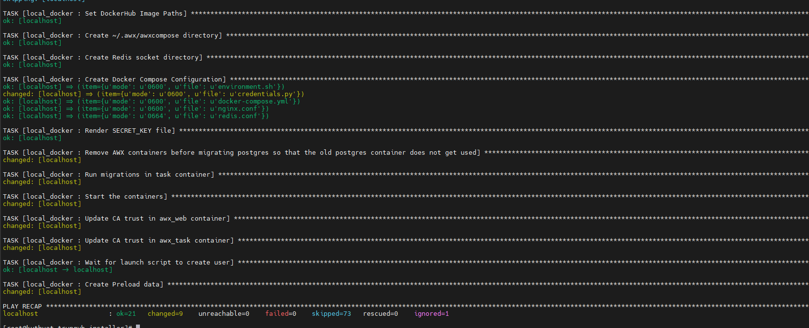
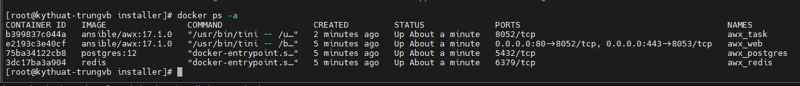
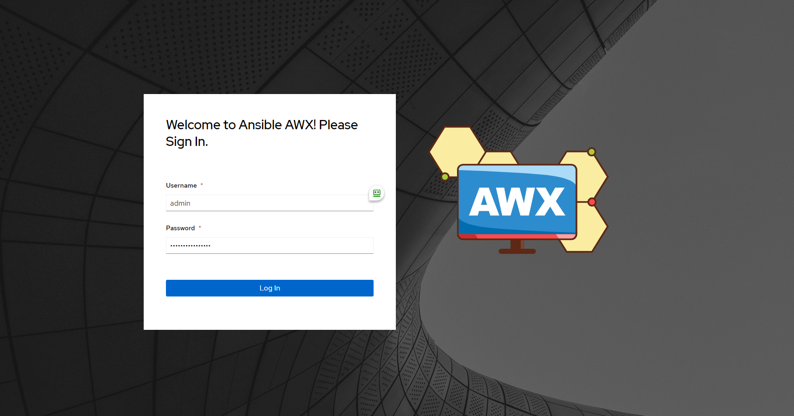
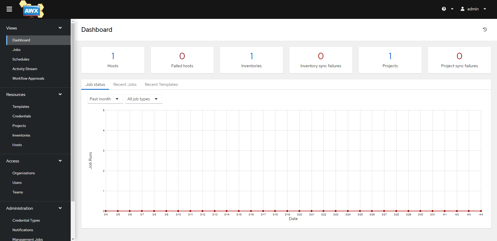

# Cài đặt AWX

  Hiện tại AWX đang được cộng đồng đóng góp rất nhiều nên có sự khác biệt về tính năng và giao diện giữa các phiên bản. Các phương thức triển khai AWX container cũng ngày càng được mở rộng phát triển, hiện có như Openshift, K8s, Docker-compose.

  Nhưng ở 2 phiên bản 18.x.x và 19.x.x đang chỉ hỗ trợ triển khai bằng minikube.

  Sử dụng AWX phiên bản 17.1.0 bằng Docker-compose để mọi người làm quen với AWX trước khi đi đến những bài toán sizing phức tạp hơn.

## 1. Mô hình hệ thống

  - Thực hiện cài đặt AWX dựa trên các Container được build sẵn, các file Docker compose có sẵn trên repository của AWX:

  - Ở đây sử dụng OS là CentOS 7.

## 2. Hướng dẫn cài đặt
   
  - Cài đặt epel repo và update các package

    ```
    yum -y install epel-release
    yum -y update
    ```

  - Cài đặt các gói cần thiết

    ```
    yum install git wget vim python3-pip
    ```

  - Cấu hình SELinux và tắt Firewall

    ```ini
    sed -i 's/SELINUX=enforcing/SELINUX=disabled/g' /etc/sysconfig/selinux
    sed -i 's/SELINUX=enforcing/SELINUX=disabled/g' /etc/selinux/config
    systemctl disable --now firewalld
    ```
    
  - Thiết lập hostname cho máy chủ (optional)

    ```
    hostnamectl set-hostname awx-server
    ```
    
  - Khởi động lại hệ thống

    ```init 6```

  - Cài đặt Ansible

    ```
    yum -y install ansible
    ```
    
  - Cài đặt và cấu hình Docker. Cài các gói cần thiết

    ```
    yum install -y yum-utils device-mapper-persistent-data lvm2
    ```
    
  - Cấu hình repo docker-ce

    ```
    yum-config-manager --add-repo https://download.docker.com/linux/centos/docker-ce.repo
    ```
    
  - Cài đặt Docker

    ```
    yum -y install docker-ce
    ```
    
  - Thêm người dùng hiện tại vào nhóm docker

    ```
    usermod -aG docker $(whoami)
    ```
    
  - Khởi động và enable service Docker

    ```
    systemctl daemon-reload
    systemctl enable docker --now
    ```
    
  - Mở Iptables rule để có thể NAT các địa chỉ container

    ```
    iptables -P FORWARD ACCEPT
    ```
    
  - Cài đặt Docker-compose. Cài đặt các gói cần thiết

    ```
    yum -y install rust cargo python3-devel libevent-devel openssl-devel gcc 
    pip3 install setuptools-rust 
    pip3 install wheel
    pip3 install docker
    ```
    
  - Cài đặt Docker-compose

    ```
    pip3 install docker-compose
    ```
    
  - Kiểm tra hoạt động

    ```
    docker-compose --version
    ```
    
  - Cài đặt AWX. Đầu tiên thiết lập cấu hình cert và key để sử dụng SSL/TLS

    ```ini
    cat <<EOF >>/etc/ssl/certs/awx.cnf
    [req]
    prompt = no
    distinguished_name = req_distinguished_name
    #req_extensions = v3_req
    
    [req_distinguished_name]
    countryName                     = VN
    stateOrProvinceName             = HaNoi
    localityName                    = Hanoi
    0.organizationName              = NhanHoa
    organizationalUnitName          = Infrastructure
    commonName                      = Self-signed
    emailAddress                    = trungvb@nhanhoa.com.vn
    EOF
    ```
    
  - Khởi tạo Cert và Key

    ```ini
    openssl req -x509 -nodes -config /etc/ssl/certs/awx.cnf -days 3650 -newkey rsa:2048 -keyout /etc/ssl/certs/awx.key -out  /etc/ssl/certs/awx.crt
    ```
    
  - Khởi tạo một chuỗi key ngẫu nhiên để cấu hình secret key cho AWX, lưu lại output

    ```
    openssl rand -base64 30
    ```
    
  - Clone repository của AWX từ Github

    ```ini
    git clone https://github.com/ansible/awx.git
    ```
    
  - Chuyển đến thư mục awx vừa clone về

    ```
    cd awx/
    ```
    
  - Checkout tag

    ```ini
    git checkout tags/17.1.0
    ```
    
  - Khởi tạo thư mục lưu trữ dữ liệu cho PostgreSQL, thư mục này sẽ được mount vào thư mục lưu dữ liệu trong container của PostgreSQL

    ```ini
    mkdir -p /var/lib/awx/pgdocker
    ```

  - Đi vào thư mục installer

    ```
    cd installer/
    ```
    
  - Cấu hình tệp inventory như dưới đây, bạn có thể chỉnh sửa các thông tin như port, admin_password,…

    ```ini
    localhost ansible_connection=local ansible_python_interpreter="/usr/bin/env python3"
    [all:vars]
    dockerhub_base=ansible
    awx_task_hostname=awx
    awx_web_hostname=awxweb
    postgres_data_dir="/var/lib/awx/pgdocker" # Khai báo thư mục lưu project
    host_port=80 # Khai báo port Nginx muốn sử dụng
    host_port_ssl=443
    ssl_certificate="/etc/ssl/certs/awx.crt"
    ssl_certificate_key="/etc/ssl/certs/awx.key"
    docker_compose_dir="~/.awx/awxcompose"
    pg_username=awx
    pg_password=awxpass
    pg_database=awx
    pg_port=5432
    admin_user=admin
    admin_password=Ir0xwOQP # Khai báo password của bạn
    create_preload_data=True
    secret_key=5OdA6APAPll6DM2zdYtMR9ahrMstUKvddPNn4W4P #đã khởi tạo ở bước 3
    project_data_dir=/var/lib/awx/projects # Khai báo thư mục lưu data tạo ở bước 7
    ```
    
  - Thực hiện chạy playbook cài đặt AWX

    ```ini
    ansible-playbook -i inventory install.yml
    ```

    

  - Kiểm tra container được khởi tạo

    ```docker ps -a```

    

  - Truy cập địa chỉ https://ip-address và đăng nhập bằng tài khoản với username là `admin` và password đã nhập trước đó

    
    
    

    *Lưu ý*: Nếu muốn thay đổi mật khẩu tài khoản admin, thực hiện:

    ```ini
    docker exec -it awx_web bash
    awx-manage changepassword admin
    ```
    
