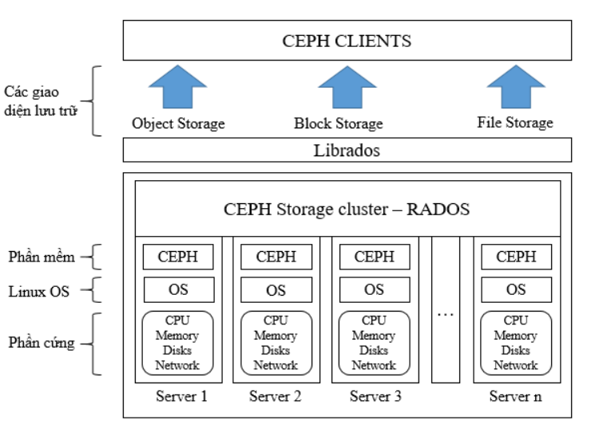
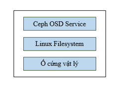
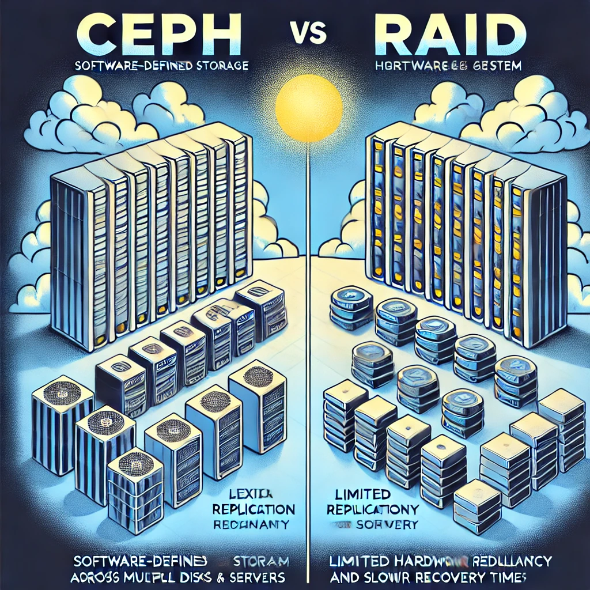
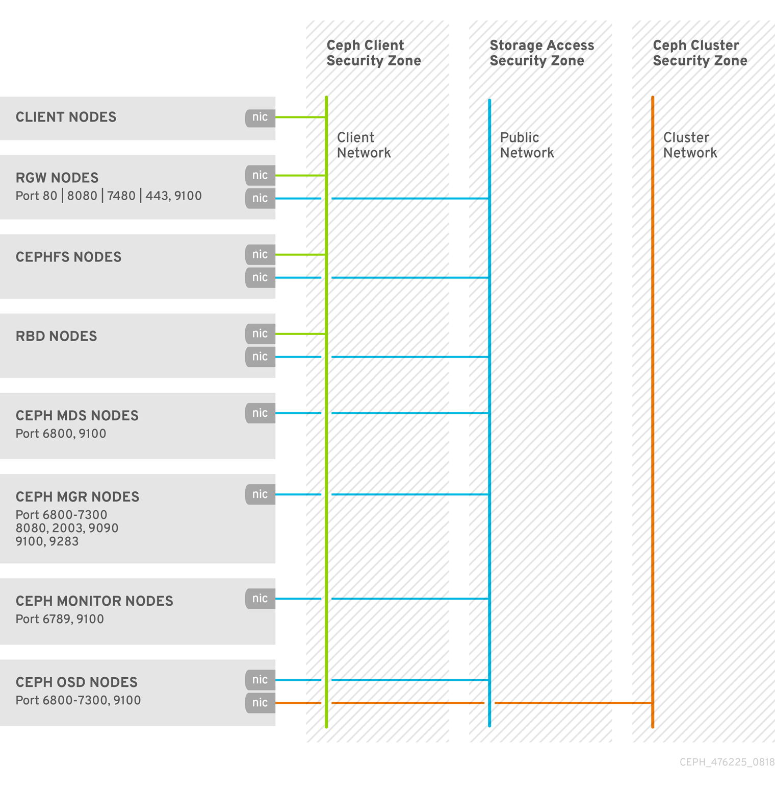
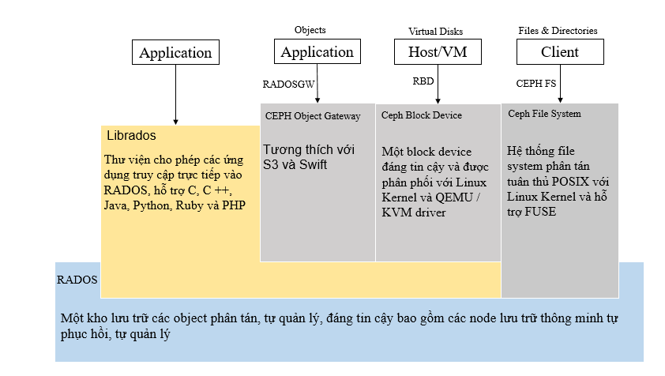
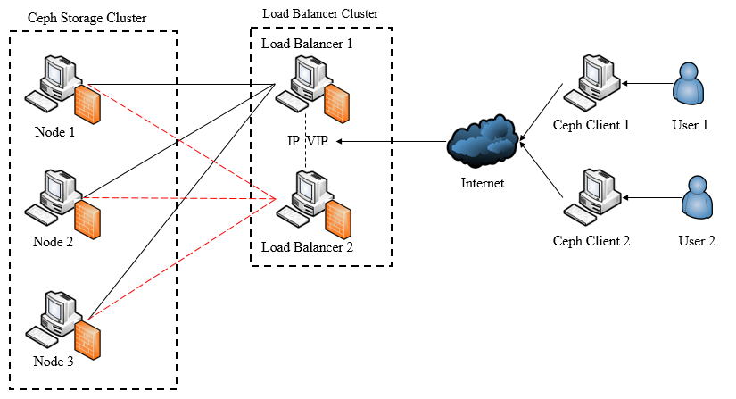

# Ceph - Software-Defined Storage (SDS)

## 1. Tổng quan

* Ceph là một hệ thống lưu trữ phân tán mã nguồn mở, được thiết kế để xử lý khối lượng dữ liệu lớn, cung cấp ba loại lưu trữ chính: Object Storage (lưu trữ đối tượng), Block Storage (lưu trữ khối) và File System (hệ thống tệp).
* Ceph không chỉ phân phối dữ liệu mà còn cung cấp khả năng mở rộng dễ dàng và chịu lỗi nhờ vào cơ chế tự quản lý và phục hồi dữ liệu sau sự cố.

* Thuật toán CRUSH: Đặc điểm nổi bật của Ceph là sử dụng thuật toán CRUSH (Controlled Replication Under Scalable Hashing), giúp xác định vị trí lưu trữ dữ liệu trong cluster mà không cần phải dựa vào metadata, từ đó tăng cường khả năng chịu lỗi và mở rộng hệ thống.
* Ceph được phát triển lần đầu bởi Sage Weil vào năm 2004, và chính thức tích hợp vào nhân Linux vào năm 2010. Hiện nay, Ceph được sử dụng rộng rãi trong các giải pháp cloud storage.

## 2. Các thành phần chính của hệ thống Ceph

Ceph OSD (Object Storage Daemon):
* OSD chịu trách nhiệm lưu trữ dữ liệu, quản lý nhân bản và phục hồi dữ liệu. Mỗi OSD đại diện cho một đơn vị lưu trữ vật lý hoặc logic, và trong một cluster Ceph có thể có hàng trăm OSD.

* OSD sử dụng các filesystem như XFS, Btrfs và Ext4 để lưu trữ dữ liệu. Trong đó, XFS được khuyến nghị do tính ổn định và hiệu suất tốt nhất cho Ceph.

Ceph Monitor (MON):
* MON giám sát trạng thái của cluster, quản lý các cluster map gồm OSD map, Monitor map, và Placement Group map. MON giúp duy trì tính nhất quán của hệ thống và thực hiện cơ chế quorum để đảm bảo hệ thống không bị chia tách.
* MON cũng tham gia vào việc xác thực và ghi nhật ký cho các hành động trong cluster.

Ceph Metadata Server (MDS):
* MDS quản lý metadata cho hệ thống tệp CephFS, cho phép Ceph lưu trữ và truy cập tệp như một hệ thống tệp POSIX. MDS giúp giảm tải cho OSD bằng cách cung cấp cache thông minh cho metadata.
* Tuy nhiên, MDS chỉ hoạt động với Ceph File System (CephFS) và hiện vẫn chưa được coi là hoàn thiện trong môi trường sản xuất lớn.

## 3. So sánh giữa Ceph và RAID

* RAID (Redundant Array of Independent Disks) đã được sử dụng rộng rãi trong nhiều năm để đảm bảo khả năng chịu lỗi khi lưu trữ dữ liệu. Tuy nhiên, RAID dần bộc lộ nhiều hạn chế như: khó mở rộng, thời gian khôi phục lâu, chi phí cao, và chỉ bảo vệ dữ liệu ở mức ổ đĩa vật lý.
* Ceph vượt trội hơn RAID nhờ khả năng tự động phân phối dữ liệu, nhân bản dữ liệu, và khả năng chịu lỗi tốt hơn. Ceph cũng sử dụng thuật toán CRUSH để tự động tính toán và phân phối dữ liệu, loại bỏ điểm yếu của RAID trong việc phụ thuộc vào metadata phức tạp.
* Ceph có thể khôi phục dữ liệu nhanh hơn RAID và chi phí tổng thể (TCO) thấp hơn do không yêu cầu phần cứng chuyên dụng.

## 4. Các giải pháp bảo mật trong Ceph

Bảo mật trong triển khai: Ceph sử dụng nhiều biện pháp để bảo mật trong quá trình triển khai hệ thống, bao gồm:
* Quản lý SSH key để kiểm soát việc truy cập từ xa.
* Cấu hình SELinux và Firewalld để đảm bảo an toàn trước các cuộc tấn công.
* Thiết lập các chế độ an toàn cho giao thức SSH, bảo vệ quá trình kết nối và triển khai hệ thống.

Bảo mật trong vận hành:
* Ceph mã hóa dữ liệu ở trạng thái nghỉ và trong quá trình truyền tải nhằm ngăn chặn sự truy cập trái phép.
* Chứng chỉ SSL được sử dụng để bảo mật cho Ceph Object Gateway, đảm bảo an toàn khi dữ liệu di chuyển qua các giao thức HTTP/HTTPS.

Quản lý người dùng và xác thực:
* Ceph sử dụng cơ chế xác thực Cephx tương tự như Kerberos, nhưng không có điểm yếu SPOF (Single Point of Failure), đảm bảo an toàn trong quá trình phân quyền và quản lý người dùng.
* Ceph cung cấp khả năng phân quyền linh hoạt, quản lý user qua các keyring để đảm bảo việc truy cập vào dữ liệu được kiểm soát chặt chẽ.

## 5. Các giải pháp lưu trữ trong Ceph

Ceph File System (CephFS):
* CephFS cho phép lưu trữ và chia sẻ tệp giữa các hệ thống, cung cấp khả năng đồng bộ dữ liệu cao.

Ceph Block Device:
* Dùng cho lưu trữ khối, thường được sử dụng trong các dịch vụ máy ảo hoặc cơ sở hạ tầng đám mây. Ceph Block Device cho phép quản lý các ổ đĩa ảo với hiệu suất cao.

Ceph Object Gateway (RADOS Gateway):
* Là giải pháp lưu trữ đối tượng, thường được sử dụng trong các dịch vụ lưu trữ đám mây như Amazon S3. Ceph Object Gateway hỗ trợ giao thức HTTP và S3, cho phép người dùng dễ dàng lưu trữ và truy xuất dữ liệu từ xa.

## 6. Mô hình triển khai hệ thống Ceph

* Triển khai mô hình Ceph bao gồm:
  * IP Planning để cấu hình các địa chỉ IP cho các thành phần trong cluster.
  * Cấu hình DNS Server và HAProxy cho Ceph Object Gateway để đảm bảo dịch vụ luôn sẵn sàng ngay cả khi xảy ra sự cố.
  * Failover bằng cách sử dụng Keepalived để đảm bảo khi một node bị down, hệ thống vẫn tiếp tục hoạt động mà không bị gián đoạn.

* Quản lý hệ thống Ceph: Đồ án cung cấp hướng dẫn cụ thể về cách kiểm tra, vận hành và bảo trì hệ thống Ceph, bao gồm cả quản lý qua Ceph Dashboard và dòng lệnh.

## 7. Bảo mật dữ liệu

* Mã hóa dữ liệu tại chỗ (Encryption at Rest): Ceph cung cấp khả năng mã hóa dữ liệu khi lưu trữ, đảm bảo dữ liệu không bị truy cập trái phép khi hệ thống không hoạt động.
* Bảo mật trong quá trình truyền tải: Ceph mã hóa dữ liệu trong quá trình truyền giữa các thành phần bằng Messenger V2 và hỗ trợ sử dụng SSL certificates để bảo mật dịch vụ Ceph Object Gateway.
* Quản lý và phân quyền người dùng: Cephx cung cấp cơ chế xác thực mạnh mẽ và linh hoạt cho việc quản lý và phân quyền người dùng trong cluster. Điều này giúp kiểm soát chặt chẽ việc truy cập vào hệ thống và dữ liệu.

## 8. Kết luận

* Kết luận: Ceph là một giải pháp lưu trữ mạnh mẽ, có khả năng mở rộng tốt, phù hợp cho các hệ thống yêu cầu khả năng lưu trữ lớn, phân tán và an toàn. Các giải pháp bảo mật được triển khai đảm bảo dữ liệu được bảo vệ ở mức cao nhất.
* Hệ thống Ceph là lựa chọn tối ưu cho các hệ thống cloud private, public, hoặc hybrid, nhờ vào khả năng tích hợp linh hoạt, chi phí hợp lý và tiềm năng phát triển trong tương lai.
