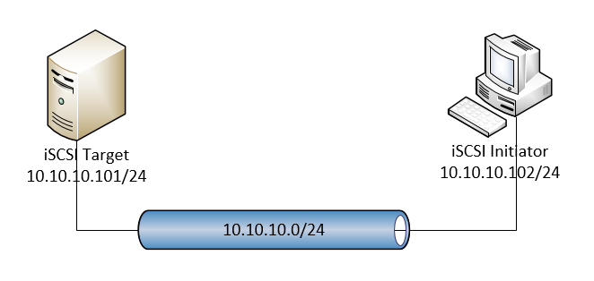

# SAN

## 1.Tổng quan

- SAN (Storage area network) là kỹ thuật lưu trữ dữ liệu dạng block-level thông qua kết nối mạng.
- SAN được sử dụng để tăng khả năng lưu trữ của thiết bị, như disk arrays, tape libraries, etc.
- SAN thường có mạng lưới lưu trữ riêng mà không thông qua mạng LAN với các thiết bị khác.
- SAN sử dụng các giao thức sau: Fibre Channel, iSCSI, ATA over Ethernet (AoE) and HyperSCSI.

## 2.iSCSI protocol

- iSCSI (Internet Small Computer Systems Interface) là là giao thức Internet thuộc tầng application để lưu trữ thông qua Internet. Nó cung cấp truy cập block-level để truy cập thiết bị lưu trữ.
- iSCSI được sử dụng để truyền data qua LAN, WAN hoặc Internet.
- Một số khái niệm:
   - Initiator: là 1 iSCSI client.
   - Target: là nơi chứa thiết bị lưu trữ data gọi – iSCSI server.
- iSCSI sử dụng giao thức TCP (tiêu biểu là port 860 và 3260)

## 3.LAB iSCSI protocol

### 3.1.Tổng quan

Mô hình:

Trong đó:

   - iSCSI Initiator: là Client sử dụng giao thức iSCSI để giao tiếp và sử dụng thiết bị lưu trữ bên Target.
   - iSCSI Target: là Server chứa thiết bị lưu trữ và được truy cập bởi client.
   - 2 máy đều cài hệ điều hành Ubuntu Server 16.04

Cài đặt:

   - iSCSI Initiator : Dùng gói “open-iscsi”.
       - File cấu hình trong thư mục /etc/iscsi gồm:
           - iscsid.conf: File cấu hình cho iscsi daemon. Nó đọc để startup.
           - initiatorname.iscsi: Tên của initator, daemon reds at the startup.
           - nodes directory: Thư mục chứa nodes và targets của họ.
           - send_targets directory: Thư mục chứa các targets được discovered.

open-iscsi được điều khiển bởi câu lệnh iscsiadm. Câu lệnh có thể discover các target, login/logout các target, display thông tin các session.

   - iSCSI target: Dùng gói “iscsitarget”
       - File cấu hình bao gồm:
           - Các file trong thư mục /etc/iet
           - File /etc/default/iscsitarget

