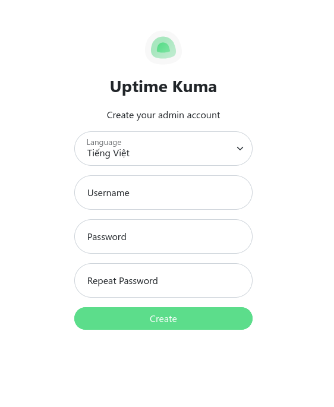

# 1. Tầm quan trọng của uptime

Uptime là một thước đo thời gian mà một hệ thống hoặc dịch vụ có sẵn và hoạt động mà không bị gián đoạn. Tầm quan trọng của uptime được hiểu rộng rãi trong ngữ cảnh của các hệ thống máy chủ, dịch vụ web, ứng dụng, và môi trường kinh doanh chung. Dưới đây là một số điểm quan trọng:

   - Đảm bảo sẵn sàng dịch vụ: Uptime là một chỉ số quan trọng để đo lường khả năng sẵn sàng của dịch vụ. Một số ứng dụng quan trọng, như trang web thương mại điện tử, dịch vụ ngân hàng trực tuyến, và ứng dụng doanh nghiệp, yêu cầu sự liên tục và không gián đoạn để đảm bảo rằng người dùng có thể truy cập vào bất cứ lúc nào.
   - Giảm thiểu tác động kinh doanh: Mất mát uptime có thể ảnh hưởng nghiêm trọng đến doanh nghiệp. Nó có thể dẫn đến mất mát doanh thu, tổn thất khách hàng, và tổn thất uy tín doanh nghiệp. Điều này đặc biệt quan trọng đối với các doanh nghiệp có hoạt động trực tuyến quan trọng.
   - Tăng cường trải nghiệm người dùng: Người dùng hiện đại đặt kỳ vọng cao đối với sự liên tục của dịch vụ. Mất mát uptime có thể tạo ra trải nghiệm người dùng không hài lòng, ảnh hưởng đến lòng tin và sự trung thực của khách hàng đối với một dịch vụ hoặc thương hiệu.
   - Giảm chi phí do mất mát doanh thu: Mỗi giờ, mỗi ngày mất mát uptime đều có thể dẫn đến mất mát doanh thu. Điều này bao gồm việc mất doanh thu trực tiếp và chi phí cần phải chi trả để khắc phục sự cố và khôi phục dịch vụ.
   - Tăng cường uy tín và danh tiếng: Dịch vụ hoạt động ổn định với uptime cao giúp xây dựng uy tín và danh tiếng cho doanh nghiệp. Ngược lại, sự cố thường xuyên có thể tạo ra ấn tượng tiêu cực về mức độ chuyên nghiệp của doanh nghiệp.
   - Đáp ứng yêu cầu hợp đồng dịch vụ: Nhiều hợp đồng dịch vụ và cam kết đối với khách hàng đều đặt ra các tiêu chuẩn về uptime. Đảm bảo tuân thủ các cam kết này không chỉ giữ cho doanh nghiệp đáp ứng yêu cầu hợp đồng mà còn giữ cho mối quan hệ khách hàng được duy trì.

Uptime là yếu tố quan trọng đối với sự thành công của hệ thống và dịch vụ, ảnh hưởng trực tiếp đến khả năng phục vụ khách hàng và hiệu quả kinh doanh tổng thể.

# 2. Giới thiệu về Uptime Kuma

Uptime Kuma là một công cụ mã nguồn mở miễn phí giúp giám sát trạng thái hoạt động của website và các dịch vụ hệ thống.

Thông tin và tính năng Uptime Kuma cung cấp:

   - Giám sát thời gian hoạt động (uptime) của các dịch vụ như HTTP(s) / TCP / HTTP(s) Từ khóa / HTTP(s) Json Query / Ping / DNS Record / Push / Steam Game Server / Docker Containers.
   - Giao diện người dùng trực quan, nhanh chóng.
   - Hỗ trợ thông báo qua Telegram, Discord, Gotify, Slack, Pushover, Email (SMTP) và hơn 90 dịch vụ thông báo, nhấp vào đây để xem danh sách đầy đủ.
   - Có thể giám sát, kiểm tra theo chu kỳ 20 giây.
   - Hỗ trợ nhiều ngôn ngữ.
   - Hỗ trợ nhiều trang trạng thái.
   - Ánh xạ các trang trạng thái tới các tên miền cụ thể.
   - Biểu đồ Ping.
   - Thông tin chứng chỉ SSL.
   - Hỗ trợ proxy.
   - Hỗ trợ 2FA.

# 3. Hướng dẫn cài đặt Uptime Kuma

- Trước tiên sẽ đăng nhập SSH và cài đặt Docker cho VPS.

- Sau đó chạy lệnh bên dưới để tiến hành cài đặt Uptime Kuma:
> docker run -d --restart=always -p 3001:3001 -v uptime-kuma:/app/data --name uptime-kuma louislam/uptime-kuma:1
```
vann@ubuntu:~$ docker run -d --restart=always -p 3001:3001 -v uptime-kuma:/app/data --name uptime-kuma louislam/uptime-kuma:1
Unable to find image 'louislam/uptime-kuma:1' locally
1: Pulling from louislam/uptime-kuma
8e208ccce385: Pull complete 
d4781d947d98: Pull complete 
da1998da34c0: Pull complete 
2bf5a632d8e4: Pull complete 
5bc7dff3aaf3: Pull complete 
2fa455cae2bf: Pull complete 
b09759921de7: Pull complete 
ef94e1d893c1: Pull complete 
1957dcecc453: Pull complete 
1dd5af03256d: Pull complete 
4f4fb700ef54: Pull complete 
0e893e9bc55f: Pull complete 
Digest: sha256:96510915e6be539b76bcba2e6873591c67aca8a6075ff09f5b4723ae47f333fc
Status: Downloaded newer image for louislam/uptime-kuma:1
51f3ceaad23d1c4383268bb8b45dc17edb1e4133664df5a958d2e8f48b6f8548
```

- Sau khi Uptime Kuma được cài đặt xong, có thể truy cập giao diện thông qua URL http://<ip_server>:3001/ (ip_server là IP VPS (Server)).
- Sau đó lập tài khoản đăng nhập quản trị cho Uptime Kuma.
  
  
- Đăng nhập thành công sẽ có giao diện quản trị như hình.
  

- Thiết lập phương thức nhận thông báo qua Telegram
- Để thiết lập phương thức nhận thông báo qua Telegram, truy cập theo hình như sau:
  
  
  
  
