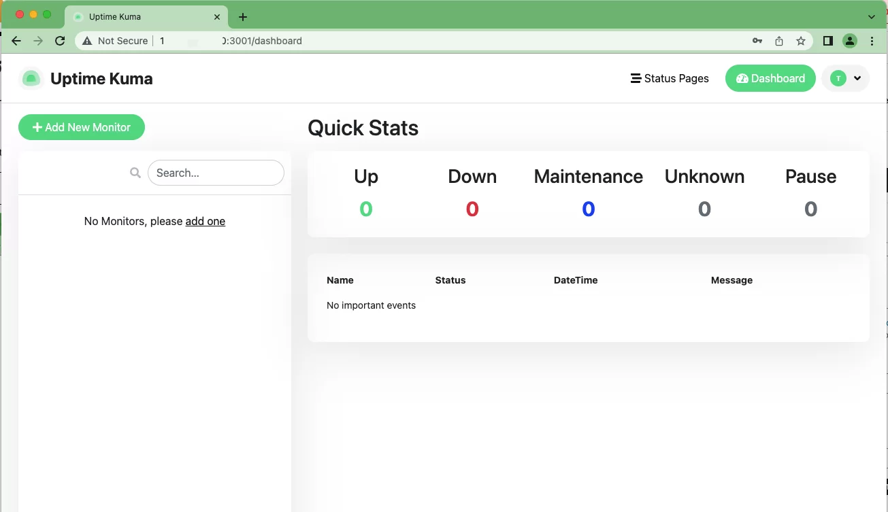
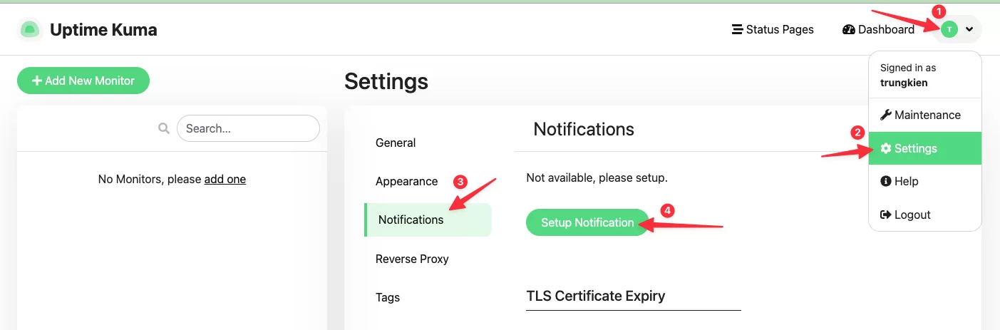
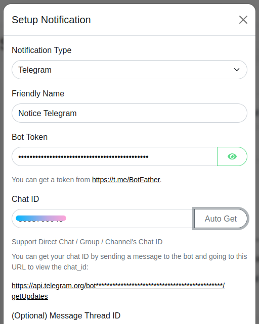
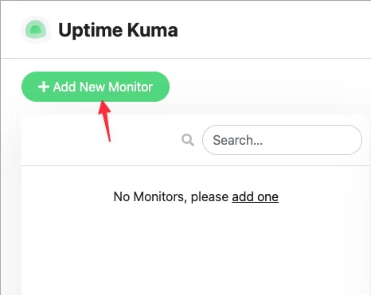
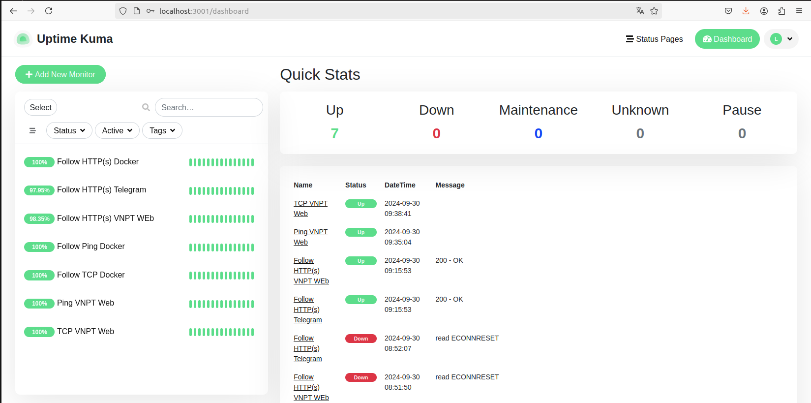
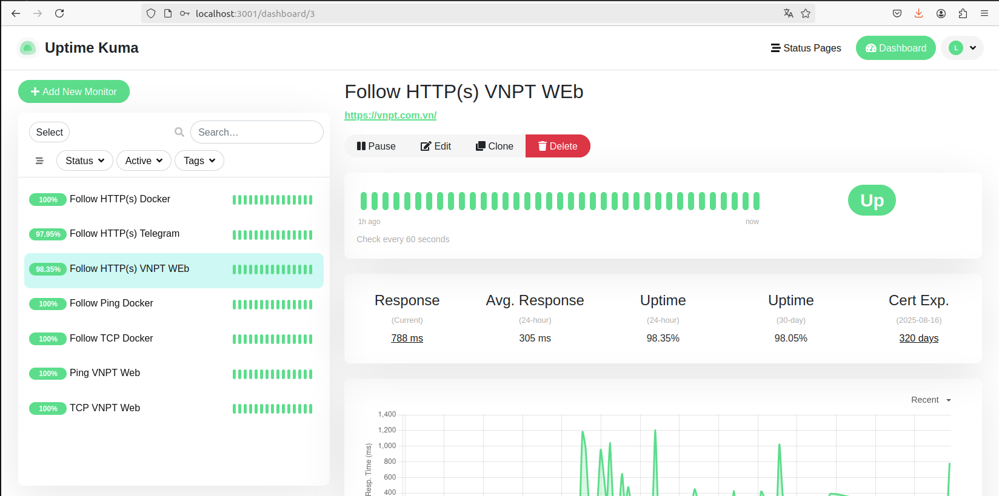

# Giới thiệu về Uptime Kuma

Uptime Kuma là một công cụ mã nguồn mở miễn phí giúp giám sát trạng thái hoạt động của website và các dịch vụ hệ thống.

Thông tin và tính năng Uptime Kuma cung cấp:

   - Giám sát thời gian hoạt động (uptime) của các dịch vụ như HTTP(s) / TCP / HTTP(s) Từ khóa / HTTP(s) Json Query / Ping / DNS Record / Push / Steam Game Server / Docker Containers.
   - Giao diện người dùng trực quan, nhanh chóng.
   - Hỗ trợ thông báo qua Telegram, Discord, Gotify, Slack, Pushover, Email (SMTP) và hơn 90 dịch vụ thông báo, nhấp vào đây để xem danh sách đầy đủ.
   - Có thể giám sát, kiểm tra theo chu kỳ 20 giây.
   - Hỗ trợ nhiều ngôn ngữ.
   - Hỗ trợ nhiều trang trạng thái.
   - Ánh xạ các trang trạng thái tới các tên miền cụ thể.
   - Biểu đồ Ping.
   - Thông tin chứng chỉ SSL.
   - Hỗ trợ proxy.
   - Hỗ trợ 2FA.

# Hướng dẫn cài đặt Uptime Kuma

- Trước tiên sẽ đăng nhập SSH và cài đặt Docker cho VPS.

- Sau đó chạy lệnh bên dưới để tiến hành cài đặt Uptime Kuma:
> docker run -d --restart=always -p 3001:3001 -v uptime-kuma:/app/data --name uptime-kuma louislam/uptime-kuma:1
```
vann@ubuntu:~$ docker run -d --restart=always -p 3001:3001 -v uptime-kuma:/app/data --name uptime-kuma louislam/uptime-kuma:1
Unable to find image 'louislam/uptime-kuma:1' locally
1: Pulling from louislam/uptime-kuma
8e208ccce385: Pull complete 
d4781d947d98: Pull complete 
da1998da34c0: Pull complete 
2bf5a632d8e4: Pull complete 
5bc7dff3aaf3: Pull complete 
2fa455cae2bf: Pull complete 
b09759921de7: Pull complete 
ef94e1d893c1: Pull complete 
1957dcecc453: Pull complete 
1dd5af03256d: Pull complete 
4f4fb700ef54: Pull complete 
0e893e9bc55f: Pull complete 
Digest: sha256:96510915e6be539b76bcba2e6873591c67aca8a6075ff09f5b4723ae47f333fc
Status: Downloaded newer image for louislam/uptime-kuma:1
51f3ceaad23d1c4383268bb8b45dc17edb1e4133664df5a958d2e8f48b6f8548
```

- Sau khi Uptime Kuma được cài đặt xong, có thể truy cập giao diện thông qua URL http://<ip_server>:3001/ (ip_server là IP VPS (Server)).
- Sau đó lập tài khoản đăng nhập quản trị cho Uptime Kuma.
  
  
- Đăng nhập thành công sẽ có giao diện quản trị như hình.
  

- Thiết lập phương thức nhận thông báo qua Telegram
- Để thiết lập phương thức nhận thông báo qua Telegram, truy cập theo hình như sau:
  

  1. Notification Type: Chọn kênh nhận thông báo Telegram
  2. Friendly Name: Đặt tên cho thông báo
  3. Bot Token: Nhập mã Token Telegram
  4. ID Chat: Nhập ID Bot hoặc ID Group Telegram
   

 - Nhập thông tin xong nhấn Save lại.
 - Thêm website cần giám sát
 - Để thêm một hành động giám sát mới, tại giao diện Uptime Kuma click chọn Add New Monitor
   
   
 - Thiết lập thành công sẽ thấy list danh sách giám sát đã thêm ở Dashboard.
   

 - Giao diện theo dõi HTTP(s) của web VNPT
    
  
  
