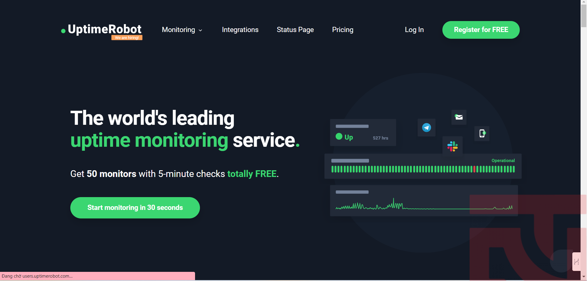

# Tổng quan

## 1. Giới thiệu Uptime Robot
* Uptime Robot là một công cụ được thiết kế để giám sát các trang web một cách thường xuyên để kiểm tra xem có trang web nào bị sập do vấn đề máy chủ hoặc phát sinh lỗi hay không. 

* Nó luôn giám sát các trang web thường xuyên và giữ chúng trong tình trạng hoạt động được.

* Uptime Robot kiểm tra HTTP, ping, port, từ khóa dự định và thông báo qua SMS hoặc email để thông báo cho người dùng biết rằng công việc của họ đã được hoàn thành.

* Công cụ này có thể được sử dụng để xem thời gian hoạt động và thời gian ngừng hoạt động của một trang web và thực hiện xác minh kỹ lưỡng cho thời gian ngừng hoạt động từ nhiều địa điểm và người dùng có thể bỏ qua thông báo thường xuyên về thời gian ngừng hoạt động từ trang web của họ bằng cách tùy chỉnh theo ý muốn.

* Uptime Robot cho phép người dùng thực hiện các tác vụ mới nhất với giao diện REST API giao tiếp và cho phép chia sẻ các thống kê với đồng nghiệp, khách hàng hoặc người truy cập. Nó đi kèm với các giao thức khác nhau để giải quyết sự cố máy chủ hoặc các sự cố về mã lập trình và giữ cho các trang web hoạt động liên tục.

## 2. Với Uptime Robot, có thể giám sát những gì?
* Uptime Robot là một công cụ miễn phí được sử dụng để giám sát các trang web. Nó sẽ kiểm tra trạng thái của trang web mỗi 5 phút và thông báo nếu trang web của người dùng bị sập.

* Các loại giám sát có thể thực hiện là gì? Dưới đây là các loại giám sát có sẵn:
    - http(s): Đây là loại giám sát hoàn hảo cho việc giám sát trang web. Dịch vụ này sẽ định kỳ gửi yêu cầu (giống như khi một người truy cập duyệt trang web của người dùng) đến URL và quyết định liệu trang web đó có hoạt động hay không dựa trên trạng thái HTTP trả về từ trang web (200-thành công, 404-không tìm thấy, …).
    - ping: Đây là cách tốt để giám sát một máy chủ. Yêu cầu ping (ICMP) được gửi và trạng thái hoạt động/hủy bỏ được quyết định dựa trên “xem liệu phản hồi có được nhận hay không”. Tuy nhiên, ping không phù hợp để giám sát trang web vì một trang web (IP của nó) có thể phản hồi yêu cầu ping trong khi vẫn bị sập (tức là trang web đó bị sập nhưng máy chủ chứa trang web đó vẫn hoạt động).
    - keyword: Kiểm tra xem một từ khóa có tồn tại hay không tồn tại trên một trang web.
    - port: Đây là cách tốt để giám sát các dịch vụ như smtp, dns, pop vì tất cả các dịch vụ này chạy trên một cổng cụ thể và Uptime Robot sẽ quyết định trạng thái của chúng dựa trên việc chúng có phản hồi lại yêu cầu hay không.

# Mô hình: 
* Là một dịch vụ dựa trên đám mây, chỉ cần tạo một tài khoản để bắt đầu sử dụng mà không cần phải cài đặt bất kỳ phần mềm nào.

* Tính năng nổi bật:
    - Giám sát trang web và các dịch vụ qua nhiều loại giao thức.
    - Gói miễn phí cho phép theo dõi 50 trang web, phù hợp cho các cá nhân hoặc doanh nghiệp nhỏ.
    - Hỗ trợ nhiều phương thức thông báo và cảnh báo.
    - Giao diện đơn giản, dễ dàng sử dụng cho người mới bắt đầu.

* Ưu điểm: Dễ sử dụng, không cần cài đặt, và có gói miễn phí.

* Nhược điểm: Có giới hạn về số lượng kiểm tra và tính năng trong gói miễn phí, cần phải trả phí để nâng cấp lên nhiều tính năng hơn.

## Các Tính Năng Sau Khi Nâng Cấp Tài Khoản Uptime Robot
* Số Lượng Kiểm Tra (Monitors) Tăng Cao Hơn:
    - Với tài khoản miễn phí, chỉ có thể theo dõi tối đa 50 trang web hoặc dịch vụ. Khi nâng cấp có thể theo dõi nhiều hơn (từ 100 đến 10.000 dịch vụ tùy theo gói).

* Thời Gian Kiểm Tra:
    - Gói miễn phí kiểm tra mỗi 5 phút, nhưng nâng cấp lên các gói trả phí sẽ cho phép kiểm tra mỗi 1 phút. Điều này giúp phát hiện sự cố nhanh hơn.

* Thông Báo Đa Dạng:
    - Tài khoản nâng cấp cung cấp nhiều tùy chọn thông báo hơn (như SMS, webhook, và tích hợp với các dịch vụ khác) và cho phép tùy chỉnh thông báo chi tiết hơn.

* Báo Cáo Nâng Cao:
    - Gói trả phí có thể cung cấp các báo cáo chi tiết hơn về thời gian hoạt động, thời gian chết, và hiệu suất của các dịch vụ đang giám sát.

* Tính Năng API:
    - Tài khoản trả phí cho phép truy cập vào API của Uptime Robot, giúp tự động hóa việc quản lý các kiểm tra hoặc tích hợp với các ứng dụng khác.
