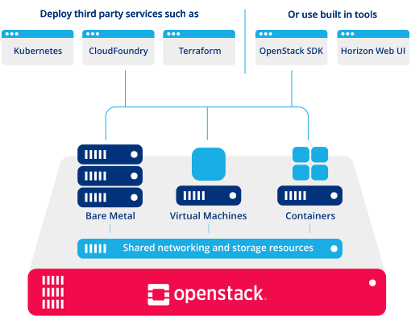
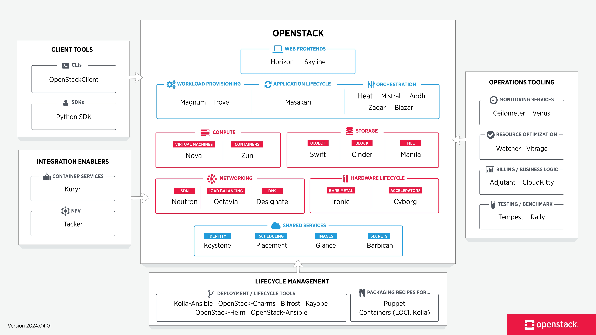
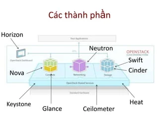
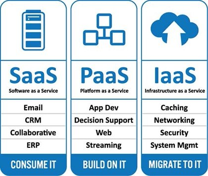
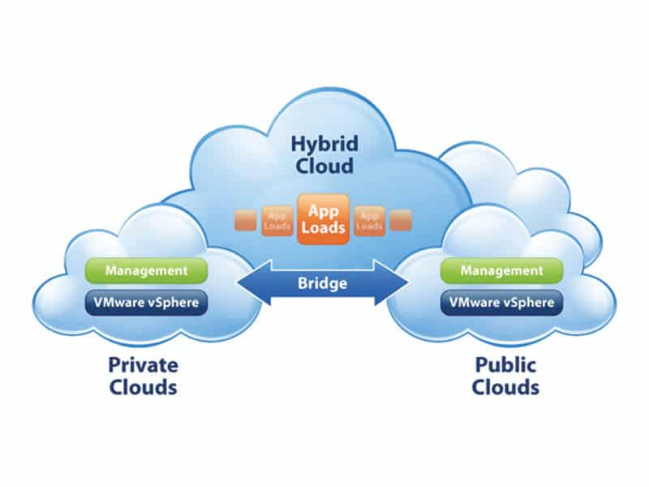

# Tổng quan về Cloud Computing - Điện toán đám mây

## 1. Cloud Computing (Điện toán đám mây)
* Cloud computing là một thuật ngữ chung cho bất kỳ điều gì liên quan đến việc cung cấp dịch vụ lưu trữ qua Internet. Có thể hiểu một cách đơn giản là lưu trữ và truy cập dữ liệu, chương trình qua Internet thay vì phần cứng máy tính của bạn.

* Cloud computing là mô hình cho phép truy cập mạng theo yêu cầu phổ biến, thuận tiện, phổ biến vào nhóm tài nguyên điện toán có thể định cấu hình chung (ví dụ: mạng, máy chủ, storage, ứng dụng và dịch vụ) có thể nhanh chóng được cung cấp và phát hành với nỗ lực quản lý tối thiểu hoặc tương tác với nhà cung cấp dịch vụ.

* **Khái quát:** Cloud computing là mô hình cung cấp tài nguyên máy tính (mạng, máy chủ, storage, ứng dụng,...) trên internet theo nhu cầu của người dùng.

* **Các dịch vụ được chia thành 3 loại chính:**
  - **Infrastructure as a service (IaaS)** : Cơ sở hạ tầng như một dịch vụ
  - **Platform as a service (PaaS)** : Nền tảng như một dịch vụ
  - **Software as a service (SaaS)** : Phần mềm như một dịch vụ

* **Mô hình Cloud này bao gồm: (Khái niệm 5-3-4)**
  - 5 đặc điểm thiết yếu
  - 3 mô hình dịch vụ
  - 4 mô hình triển khai

* **Cloud có thể là private và public.**
  - Public cloud bán dịch vụ cho bất kỳ ai trên internet
  - Private cloud là mạng độc quyền hoặc trung tâm dữ liệu cung cấp dịch vụ được lưu trữ cho một số người giới hạn, với các quyền truy cập và quyền nhất định.

**Dù là public hay private, mục tiêu của cloud computing là cung cấp quyền truy cập dễ dàng, có thể mở rộng vào các tài nguyên điện toán và dịch vụ IT.**

## 2. Mô hình Cloud 5-3-4

### 2.1. Đặc điểm thiết yếu (5 đặc điểm)
1. **On-demand self-service** (Dịch vụ tự phục vụ theo yêu cầu) : Khách hàng có thể tự quản lý, cài đặt, gia hạn, thay đổi cấu hình mà không cần phải thông qua nhà cung cấp

2. **Broad network access** (Truy cập mạng rộng) : Khả năng có sẵn trên mạng và được truy cập thông qua các cơ chế tiêu chuẩn thúc đẩy sử dụng bởi các nền tảng máy khách (client platform) thin hoặc thick phức tạp. (ví dụ: điện thoại di động, máy tính bảng, laptop hay  máy trạm)

    Người dùng có thể truy cập dữ liệu trên Cloud hoặc tải dữ liệu lên cloud từ bất kỳ đâu có internet.

3. **Resource pooling** (Nguồn tổng hợp) : Các tài nguyên điện toán của nhà cung cấp được tổng hợp lại để phục vụ nhiều người dùng sử dụng với mô hình multi-tenant (nhiều người thuê), với các tài nguyên vật lý và ảo khác nhau được gán động và phân bổ lại theo nhu cầu của người dùng.
    
    Ý nghĩa của sự độc lập về vị trí là khách hàng thường không có quyền kiểm soát hoặc kiến thức về vị trí chính xác của các tài nguyên được cung cấp nhưng có thể chỉ định vị trí ở mức độ trừu tượng cao hơn (ví dụ: quốc gia, tiểu bang hoặc datacenter). Ví dụ về tài nguyên bao gồm storage, processing, memory và network bandwidth.

    Multi-tenancy cho phép nhiều khách hàng chia sẻ cùng một cơ sở hạ tầng vật lý hoặc cùng các ứng dụng, nhưng vẫn giữ được quyền riêng tư và bảo mật đối với dữ liệu của chính họ. Với việc tổng hợp tài nguyên, các nhà cung cấp đám mây phục vụ nhiều khách hàng từ các tài nguyên vật lý tương tự nhau. Nhóm tài nguyên của các nhà cung cấp đám mây phải rất lớn và đủ linh hoạt để họ có thể phục vụ các yêu cầu của nhiều khách hàng

    Khách hàng được cung cấp tài nguyên có quyền tự phần chia, thiết lập trên khoảng tài nguyên đó

4. **Rapid elasticity** (Tính đàn hồi nhanh) : Khả năng có thể được cung cấp và giải phóng một cách linh hoạt, trong một số trường hợp tự động, nhanh chóng mở rộng ra ngoài và thu vào tương ứng với yêu cầu.

    Đối với người dùng, các khả năng cung cấp thường xuất hiện là không giới hạn và có thể được sử dụng ở bất kỳ số lượng nào và bất kỳ lúc nào.

5. **Measured service** (Dịch vụ đo lường) : Các hệ thống Cloud tự động kiểm soát và tối ưu hóa việc sử dụng tài nguyên bằng cách tận dụng khả năng đo lường ở một mức độ trừu tượng phù hợp với loại dịch vụ (ví dụ: storage, processing, bandwidth, và active user accounts)

    Việc sử dụng tài nguyên có thể được theo dõi, kiểm soát và báo cáo, cung cấp sự minh bạch cho cả nhà cung cấp và người tiêu dùng của dịch vụ sử dụng.

### 2.2. Mô hình dịch vụ (3 mô hình)
1. **Software as a Service (SaaS)** : Khả năng cung cấp cho người tiêu dùng là sử dụng các ứng dụng của nhà cung cấp chạy trên hạ tầng cloud.

    Các ứng dụng có thể truy cập từ nhiều thiết bị khách khác nhau thông qua giao diện máy khách tối thiểu, chẳng hạn như trình duyệt web (email trên web) hoặc giao diện chương trình.

    Người dùng không quản lý hay kiểm soát cơ sở hạ tầng Cloud cơ bản bao gồm mạng, máy chủ, hệ điều hành, storage hoặc thậm chí các khả năng ứng dụng riêng lẻ, ngoại trừ các cài đặt cấu hình ứng dụng cụ thể của người dùng.

    Người dùng có thể truy cập các ứng dụng và dịch vụ SaaS từ bất kỳ vị trí nào bằng máy tính hoặc thiết bị di động có kết nối internet. Người dùng có quyền truy cập vào phần mềm ứng dụng và cơ sở dữ liệu.

    **Ví dụ:** Microsoft Office 365 và các dịch vụ mail

    **Cơ sở hạ tầng Cloud:** là tập hợp phần cứng và phần mềm cho phép 5 đặc điểm thiết yếu của Cloud computing. Cơ sở hạ tầng Cloud có thể được xem là chứa cả lớp vật lý và trừu tượng. Về mặt khái niệm, lớp trừu tượng nằm trên lớp vật lý.
    - Lớp vật lý bao gồm các tài nguyên phần cứng cần thiết để hỗ trợ các dịch vụ Cloud được cung cấp, thường bao gồm các thành phần: máy chủ, storage, mạng.
    - Lớp trừu tượng bao gồm các phần mềm được triển khai trên lớp vật lý, biểu hiện các đặc tính cloud thiết yếu.

2. **Platform as a Service (PaaS)** : Khả năng cung cấp cho người dùng là triển khai trên cơ sở hạ tầng Cloud do người dùng tạo ra hoặc có được các ứng dụng được tạo ra bằng ngôn ngữ lập trình, thư viện, dịch vụ và công cụ được nhà cung cấp hỗ trợ.

    Người tiêu dùng không quản lý hoặc kiểm soát hạ tầng Cloud cơ bản bao gồm mạng, máy chủ, hệ điểu hành hay storage nhưng có quyền kiểm soát các ứng dụng đã triển khai và có thể cài đặt cấu hình cho môi trường lưu trữ ứng dụng.

    Người dùng truy cập các công cụ này qua internet bằng API, web port hoặc gateway software. PaaS được sử dụng để phát triển phần mềm nói chung. Các nhà cung cấp PaaS phổ biến bao gồm Nền tảng sét của Salesforce, BeanSalk AWS và Google App Engine.

    Ví dụ: Tiki, Lazada, ... là những PaaS cung cấp nền tảng bán hàng, nơi mà người dùng truy cập sử dụng tạo các gian hàng tùy ý để trao đổi, buôn bán

3. **Infrastructure as a Service (IaaS)** : Khả năng cung cấp cho người dùng là cung cấp xử lý, lưu trữ, mạng và các tài nguyên điện toán cơ bản khác nơi người dùng có thể triển khai và chạy phần mềm tùy ý, có thể bao gồm các hệ điều hành và ứng dụng.

    Người dùng không quản lý hoặc kiểm soát cơ sở hạ tầng Cloud mà có quyền kiểm soát các hệ điều hành, lưu trữ và các ứng dụng được triển khai và có thể kiểm soát hạn chế các thành phần mạng được chọn (ví dụ: tường lửa máy chủ).

### 2.3. Mô hình triển khai (4 mô hình triển khai)
1. **Private cloud** : 
    - Private cloud được cung cấp để sử dụng độc quyền bởi một tổ chức nhiều người dùng (ví dụ: các đơn vị kinh doanh). 
    - Nó có thể được sở hữu, quản lý và vận hành bởi tổ chức, bên thứ 3 hoặc một số tổ hợp của họ và nó có thể tồn tại trong hoặc ngoài cơ sở. 
    - Các nhà cung cấp và công nghệ đám mây riêng phổ biến bao gồm VMware và OpenStack.

2. **Public cloud** :
    - Public cloud là các dịch vụ trên nền tảng Cloud Computing để cho cá nhân và tổ chức thuê.
    - Public Cloud được cung cấp cho người dùng bên ngoài internet.
    - Nó có thể được sở hữu, quản lý và vận hành bởi một tổ chức kinh doanh, học thuật hoặc chính phủ hoặc sự kết hợp của nhiều tổ chức khác nhau. Nó tồn tại trong phạm vi của nhà cung cấp Cloud
    - Các nhà cung cấp dịch vụ đám mây công cộng hàng đầu bao gồm Amazon Web Services (AWS), Microsoft Azure, IBM và Google Cloud Platform.

3. **Community cloud** :
    - Community cloud được cung cấp để sử dụng đặc quyền bởi một cộng đồng người dùng cụ thể từ các tổ chức có chung mối quan tâm (ví dụ: nhiệm vụ, yêu cầu bảo mật, chính sách và tuân thủ xem xét). Các tổ chức này chia sẻ cơ sở hạ tầng để thực hiện chung một số lợi ích của cloud

    - Nó có thể được sở hữu, quản lý và vận hành bởi một hoặc nhiều tổ chức trong cộng đồng, bên thứ 3 hoặc một số tổ hợp của họ và nó có thể tồn tại trong hoặc ngoài cơ sở.

4. **Hybrid cloud** :
    - Hybrid cloud là sự kết hợp của public cloud và private cloud. Cho phép ta khai thác điểm mạnh của từng mô hình cũng như đưa ra phương thức sử dụng tối ưu cho người dùng.

    - Các hạ tầng riêng biệt vẫn là các thực thể duy nhất nhưng được ràng buộc với nhau bởi công nghệ được tiêu chuẩn hóa hoặc độc quyền cho phép tính di động của dữ liệu và ứng dụng (Ví dụ: cloud bùng nổ để cân bằng tải giữa các đám mây)

    - Mục tiêu của hybrid cloud là tạo ra một môi trường thống nhất, tự động, có thể mở rộng, tận dụng tất cả những gì cơ sở hạ tầng đám mây công cộng có thể cung cấp, trong khi vẫn duy trì quyền kiểm soát dữ liệu quan trọng.

# Về OpenStack

## 1. Sơ lược về OpenStack 
* OpenStack là hệ điều hành đám mây kiểm soát nhiều tài nguyên tính toán, lưu trữ và mạng trong một trung tâm dữ liệu, tất cả đều được quản lý và cung cấp thông qua API với cơ chế xác thực chung.
  

 

* Có 3 nhóm chính tham gia: Nhóm điều hành, nhóm phát triển và nhóm người dùng.
* OpenStack hoạt động theo hướng mở: Công khai lộ trình phát triển, công khai mã nguồn …

## 2. Kiến trúc của OpenStack
* Kiến trúc tổng quan của OpenStack được chia thành 3 tầng:
  - Tầng ứng dụng (Your Application): Các ứng dụng/phần mềm sử dụng OpenStack
  - Tầng Hypervisor (Standard Hardware): Phần ứng máy chủ đã được ảo hóa để chia sẻ cho người dùng.
  - Dịch vụ OpenStack (Openstack Shared Services): Các thành phần cơ bản như Dashboard, Compute, Networking, API, Storage.

## 3. Bối cảnh OpenStack
* OpenStack được chia thành các dịch vụ để cho phép cắm và chạy các thành phần tùy theo nhu cầu. Bản đồ openstack cung cấp cái nhìn "tổng quan" về bối cảnh openstack để xem các dịch vụ đó phù hợp ở đâu và chúng có thể hoạt động cùng nhau như thế nào.

 

 
## 4. Các thành phần của OpenStack
* OpenStack không phải là một dự án đơn lẻ mà là một nhóm các dự án nguồn mở nhằm mục đích cung cấp các dịch vụ cloud hoàn chỉnh. OpenStack chứa nhiều thành phần:
  - OpenStack compute: là module quản lý và cung cấp máy ảo. Tên phát triển của nó Nova. Nó hỗ trợ nhiều hypervisors gồm KVM, QEMU, LXC, XenServer… Compute là một công cụ mạnh mẽ mà có thể điều khiển toàn bộ các công việc: networking, CPU, storage, memory, tạo, điều khiển và xóa bỏ máy ảo, security, access control. Bạn có thể điều khiển tất cả bằng lệnh hoặc từ giao diện dashboard trên web.
  - OpenStack Glance:là OpenStack Image Service, quản lý các disk image ảo. Glance hỗ trợ các ảnh Raw, Hyper-V (VHD), VirtualBox (VDI), Qemu (qcow2) và VMWare (VMDK, OVF). Bạn có thể thực hiện: cập nhật thêm các virtual disk images, cấu hình các public và private image và điều khiển việc truy cập vào chúng, và tất nhiên là có thể tạo và xóa chúng.
 

 

   
  - OpenStack Object Storage: dùng để quản lý lưu trữ. Nó là một hệ thống lưu trữ phân tán cho quản lý tất cả các dạng của lưu trữ như: archives, user data, virtual machine image … Có nhiều lớp redundancy và sự nhân bản được thực hiện tự động, do đó khi có node bị lỗi thì cũng không làm mất dữ liệu, và việc phục hồi được thực hiện tự động.
  - Dentity Server: quản lý xác thực cho user và projects.
  - OpenStack Netwok: là thành phần quản lý network cho các máy ảo. Cung cấp chức năng network as a service. Đây là hệ thống có các tính chất pluggable, scalable và API-driven.
  - OpenStack dashboard: cung cấp cho người quản trị cũng như người dùng giao diện đồ họa để truy cập, cung cấp và tự động tài nguyên cloud. Việc thiết kế có thể mở rộng giúp dễ dàng thêm vào các sản phẩm cũng như dịch vụ ngoài như billing, monitoring và các công cụ giám sát khác.

## 5. Mô hình giải pháp

 

* Mô hình giải pháp: Điện toán đám mây OpenStack được các nhà cung cấp dịch vụ phát triển qua 3 giải pháp:
  - IaaS (Infrastructure as a service): cung cấp/cho thuê cơ sở hạ tầng như thuê máy chủ…
  - PaaS (Platform as a service): cung cấp nền tảng để phát triển ứng dụng
  - SaaS (Software as a service): cung cấp khả năng truy cập phần mềm linh hoạt như HCM,CRM…
 

 

* Mô hình triển khai:
  - Private Cloud: sử dụng trong một doanh nghiệp và không chia sẻ với bất kỳ ai nằm ngoài doanh nghiệp đóng
  - Public Cloud: các dịch vụ trên nền tảng điện toán đám mây được dành cho cá nhân, tổ chức cùng thuê và sử dụng chung tài nguyên
  - Hybrid Cloud: mô hình lai giữa public cloud và private cloud
  - Community Cloud: các dịch vụ được các công ty cùng hợp tác xây dựng và cung cấp cho cộng đồng sử dụng
