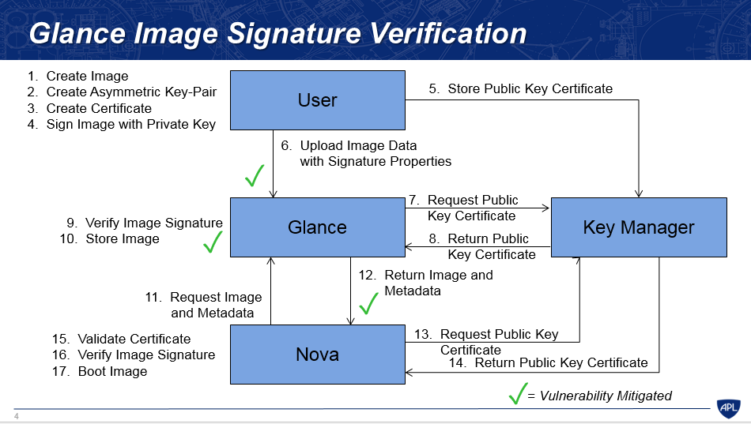
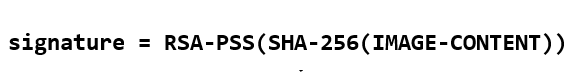

# Glance Image Signing and Verification

## 1. Đặt vấn đề về bảo mật và toàn vẹn Image
* Trước bản phát hành Liberty, không hề có phương thức nào cho các user để xác nhận rằng image họ tải lên có bị thay đổi hay không. Một image bị thay đổi có thể xảy ra trong quá trình upload từ user lên Glance hoặc Glance chuyển image tới Nova, hoặc cũng có thể do chính Glance tự mình thay đổi mà không có tác động từ phía người dùng. Một image bị thay đổi có thể chứa mã độc. Bởi vậy việc cung cấp cơ chế chữ ký số cho image và xác nhận chữ ký số cho phép user xác nhận xem image có bị thay đổi không trước khi boot image tạo máy ảo.

* Tính năng này hỗ trợ một số trường hợp như sau:

    - Một image được kí bởi end user, sử dụng private key (hiểu là mã hóa bởi private key). Sau đó, user upload image lên Glance, cùng với chữ kí vưa tạo và public key certificate của user. Glance sử dụng thông tin này để xác thực chữ ký, và thông báo tới user nếu chữ ký có bị không xác thực.

    - Một image được tạo trong Nova, và Nova ký lên image tại request của end user. Khi image được upload lên Glance, chữ ký và public key certificate cũng được cung cấp. Glance xác nhận chữ ký trước khi lưu trữ image, và thông báo với Nova nếu sự xác thực xảy ra lỗi.

    - Một image đã được ký được yêu cầu bởi Nova, và Glance cung cấp chữ ký va public key certificate tới Nova cùng image để Nova có thể xác thực chữ ký trước khi booting image.

## 2. Quá trình xác thực chữ ký image trong Glance
* Những phiên bản triển khai đầu tiên trong Liberty, thay đổi này sử dụng tính năng của Glance để lưu trữ metadate cân thiết cho việc ký và xác nhận image. Những thông tin này bao gồm: 1 public key certificate, và chữ ký.

* Những tính năng này được cung cấp khi image được tạo và có thể truy cập được khi image được upload. Lưu ý rằng tính năng này chỉ hỗ trợ upload image với Glance APIv2 (và không hỗ trợ Glance APIv1); và nhiều định dạng của key và chữ ký được hỗ trợ, định dạng chữ ký cũng được lưu trữ như là một thuộc tính của image. Certificate tham chiếu được sử dụng để truy cập tới certificate từ một key manager, nới mà các certificate được lưu trữ. Certificate này được thêm vào trong key manager bởi end user trước khi upload image. Lưu ý là chữ kí được thực hiện offline.

 

* Sau đây là luồng thực hiện ký và xác nhận image trong các trường hợp đề cập ở trên (Bước 1 tới Bước 10 là trường hợp user upload image lên Glance, từ Bước 11 là trường hợp Nova request image từ Glance để boot máy ảo):

    - Bước 1: User tạo image để upload lên Glance.

    - Bước 2: User tạo cặp key theo thuật toán mã hóa khóa công khai (khóa bất đối xứng).

    - Bước 3: User sử dụng các thông tin của mình để tạo certificate xác minh bản thân.

    - Bước 4: Ký lên image sử dụng Private Key (mã hóa image) . Chú ý bước này có sự khác biệt giữa Liberty và các bản từ Mitaka về sau:

        - ***Liberty***: Trước khi ký lên image, dữ liệu của image sẽ được băm sử dụng thuật toán MD5. Dữ liệu của image sẽ được chia thành từng phần nhỏ rồi băm. Cuối cùng ta sẽ thu lại được một mã băm **checksum_hash** của dữ liệu image. Tiếp đó mã này sẽ được sử dụng vào thuật toán băm thứ hai là SHA-256.

          
        
        - ***Mitaka*** và các phiên bản về sau: Không sử dụng thuật toán MD5 để băm dữ liệu của image. Tuy nhiên dữ liệu của image sẽ bị băm một lần sử dụng thuật toán SHA-256.

          

          Tiếp đó sử dụng Private Key đã tạo ở bước 2 để ký lên image đã bị băm.

    - Bước 5: Gửi Public Key certificate lên Key Manager để lưu trữ sử dụng giao diện Castellan (gửi thông tin certificate và public key), đồng thời thu lại giá trị `signature_certificate_uuid` sử dụng cho quá trình upload image và các đối tượng khác thu thập Public Key certificate sử dụng để xác thực sau này.

    - Bước 6: Upload Image lên Glance kèm theo các thuộc tính liên quan tới chữ ký số (các Signature metadata). Các thuộc tính này bao gồm:

        - signature: chính là chữ ký số ta thu được. Tùy thuộc phiên bản Liberty hay từ phiên bản Mitaka mà chữ ký số này sẽ được tạo ra khác nhau(theo giải thích ở bước 4). Với Liberty: `signature = RSA-PSS(SHA-256(MD5(IMAGE-CONTENT)))`. Với các phiên bản từ Mitaka trở đi: `signature = RSA-PSS(SHA-256(IMAGE-CONTENT))`

        - `signature_key_type`: là loại key được sử dụng để tạo chữ ký số. Ví dụ: RSA-PSS

        - `signature_hash_method`: là phương thức băm được sử dụng để tạo chữ kỹ. Ví dụ: SHA-256

        - `signature_certificate_uuid`: chính là cert_uuid thu được ở bước 5 khi tiến hành lưu trữ certificate.

        - `mask_gen_algorithm`: giá trị này chỉ ra thuật toán tạo mặt nạ được sử dụng trong quá trình tạo ra chữ ký số.
          Ví dụ: MGF1. Giá trị này chỉ sử dụng cho mô hình RSA-PSS.

        - `pss_salt_length`: định nghĩa sal length sử dụng trong quá trình tạo chữ ký và chỉ áp dụng cho mô hình RSA-PSS. Giá trị mặc định là `PSS.MAX_LENGTH`.

    - Bước 7 : Glance gửi request “Public key certificate” từ Key-manager để xác nhận lại chữ ký được upload lên cùng image. (public key được dùng để giải mã chữ ký). Để làm điều này Glance phải sử dụng `signature_certificate_uuid` thu được trong quá trình tải image lên của người dùng.

    - Bước 8 : Key-manager trả lại “Public key certificate” cho Glance.

    - Bước 9 : Xác nhận lại chữ kí của Image: sử dụng public key thu được cùng với các signature metadata khi image được upload lên. Việc xác thực này được thực hiện bởi module `signature_utils`.

    - Bước 10: Lưu lại image nếu chứng thực thành công. Nếu chứng thực thất bại, Glance sẽ đưa image đó vào trạng thái killed và gửi thông báo lại cho người dùng kèm theo lý do tại sao image upload bị lỗi.

    - Bước 11: Nova gửi yêu cầu tới Glance để lấy Image và metadata để boot máy ảo.

    - Bước 12: Glance gửi lại Nova image kèm theo metadata để chứng thực.

    - Bước 13: Nova yêu cầu Public Key Certificate từ Key Manager bằng việc sử dụng `cert_uuid` tương tác với giao diện Castellan

    - Bước 14: Key Manager trả về Public Key Certificate lại cho Nova

    - Bước 15: Nova xác nhận chứng chỉ. Chức năng này được thực hiện nếu chỉnh sửa module `signature_utils` của Nova để kết hợp việc xác nhận chứng chỉ (certificate validation) vào workflow của tiến trình xác thực chữ ký(signature verification).

    - Bước 16: Xác thực chữ ký của image. Để làm điều này, ta phải cấu hình trong file `nova.conf` của nova, thiết lập giá trị `verify_glance_signatures = true`. Như vậy, Nova sẽ sử dụng các thuộc tính của image, bao gồm các thuộc tính cần thiết cho quá trình xác thực chữ ký image(signature metadata). Nova sẽ đưa dữ liệu của image và các thuộc tính của nó tới module `signature_utils` để xác thực chữ ký.

    - Bước 17: Nếu việc xác thực chữ ký thành công, nova sẽ tiến hành boot máy ảo sử dụng image đó và ghi vào log chỉ ra rằng việc xác thực chữ ký thành công kèm theo các thông tin về signing certificate. Ngược lại nếu xác nhận thất bại, Nova sẽ không boot image đó và lưu lại lỗi vào log.

## 3. Một số giải pháp thay thế khác
* Sử dụng cách tiếp cận "**sign-the-data**" (từ phiên bản Mitaka về sau) thay cho "**sign-the-hash**" (Liberty). Bởi MD5 về nguyên thủy thì không được sử dụng để xác thực mà là một hàm băm, nên nó không cung cấp giải pháp bảo vệ chống lại những thay đổi có hại cũng như mã độc. Việc sử dụng hàm băm MD5 do đó gây ra sự phức tạp không cần thiết.

* Một giải pháp thay thế để lưu trữ public key certificate là sử dụng chính Glance. Tuy nhiên, hướng tiếp cận này không an toàn so với việc sử dụng Key Manager, vì chính Glance cũng tiềm ẩn nguy cơ không tin cậy trong nhiều trường hợp, không sinh ra để lưu trữ key và các chứng chỉ gốc.

* Giải pháp thay vì sử dụng mã hóa khóa bất đối xứng là sử dụng mã hóa khóa đối xứng. Tuy nhiên cách này không an toàn vì như vậy, nếu Glance muốn xác thực image, nó cần có quyền truy cập vào key đã được sử dụng để tạo chữ ký. Việc truy cập này cho phép Glance chỉnh sửa image và tạo ra chữ ký mới mà không có tác động của người dùng. Sử dụng mã hóa khóa bất đối xứng cho phép Glance xác thực chữ ký mà không cần phải được cấp quyền chỉnh sửa image hay signature. Và vì buộc phải sử dụng Public Key Certificate từ Key Manager để xác thực nên việc chỉnh sửa của Glance sẽ là không hợp lệ nếu như chỉnh sửa lại chữ ký.

* Một giải pháp đặt ra là sử dụng các thuộc tính của Glance để lưu trữ và thu thập signature metadata thông qua việc tạo các API mở rộng hỗ trợ chữ ký. Nghĩa là thay vì người dùng phải thiết lập metadata sử dụng các cặp key-value, các API mở rộng sẽ được sử dụng. Hiện tại, nếu một user được phép sử dụng metadata keys(cho các chứng chỉ và chữ ký) vì mục đích khác thì việc tải image lên sẽ gặp thất bại. Do đó các API mở rộng phải được phép quản lý nhiều chữ ký trên mỗi image một cách rõ ràng, nhưng điều này là không khả thi với hướng tiếp cận các thuộc tính. Tuy nhiên Image API cũng không hỗ trợ các API mở rộng, nên hướng tiếp cận này không phù hợp.

* Có một giải pháp khác để lưu trữ và thu thập signature metadata là sử dụng cú pháp thông điệp mật mã CMS(cryptographic message syntax) định nghĩa trong chuẩn RFC 5652 mục 5. Tuy nhiên, kích thước của định dạng sử dụng cho chuẩn này là biến số, không cố định và không thể sử dụng các thuộc tính hiện tại của Glance, điều này dẫn tới yêu cầu phải chỉnh sửa lại API. Việc chuyển sang sử dụng CMS trong tương lai sẽ được triển khai để đáp ứng nhu cầu tăng tính linh hoạt.

* Hướng mở rộng trong tương lại là hỗ trợ triển khai trên hệ thống multi-clouds thay thì single-cloud, để nếu như phát sinh nhu cầu trao đổi image giữa các cloud khác nhau, tiến trình xác thực chữ ký cũng có thể xác nhận các images có bị chỉnh sửa hay không.
