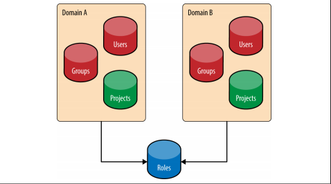

# Các thành phần và nhiệm vụ của Keystone

## 1. Các khái niệm của Keystone (Keystone concepts)
### 1.1. Projects
* Trong keystone, Project được dùng bởi các service của OPS để nhóm và cô lập các nguồn tài nguyên. Nó có thể hiểu là 1 nhóm các tài nguyên mà chỉ có một số các user mới có thể truy cập và hoàn toàn tách biệt với các nhóm khác.
* Ban đầu nó được gọi là tenants sau đó được đổi tên thành projects.
* Mục đích cơ bản nhất của Keystone chính là nơi để đăng ký cho các projects và xác định ai được phép truy cập project đó.
* Bản thân projects không sở hữu users hay groups mà users và groups được cấp quyền truy cập tới project sử dụng cơ chế gán role.
* Trong một vài tài liệu của OpenStack thì việc gán role cho user còn được gọi là "grant".

 

### 1.2. Domains
* Trong thời kì đầu, không có bất cứ cơ chế nào để hạn chế sự xuất hiện của các project tới những nhóm user khác nhau. Điều này có thể gây ra những sự nhầm lẫn hay xung đột không đáng có giữa các tên của project của các tổ chức khác nhau.
* Tên user cũng vậy và nó hoàn toàn cũng có thể dẫn tới sự nhầm lẫn nếu hai tổ chức có user có tên giống nhau.
* Vì vậy mà khái niệm Domain ra đời, nó được dùng để cô lập danh sách các Projects và Users.
* Domain được định nghĩa là một tập hợp các users, groups, và projects. Nó cho phép người dùng chia nguồn tài nguyên cho từng tổ chức sử dụng mà không phải lo xung đột hay nhầm lẫn.

 

### 1.3. Users và User Group (Actor)
* Trong keystone, Users và User Groups là những đối tượng được cấp phép truy cập tới các nguồn tài nguyên được cô lập trong domains và projects.
* Groups là một tập hợp các users. Users và User Groups gọi là actor
Mối quan hệt giữa domains, projects, users và groups:

 

### 1.4. Roles
* Roles được dùng để hiện thực hóa việc cấp phép trong keystone. Một actor có thể có nhiều roles đối với từng project khác nhau.
* Role được gán cho user và trên một project cụ thể ("assigned to" user, "assigned on" project)
### 1.5. Assignment
* Role assignment gồm một Role, một Resource và một Identity.
* Role assignment được cấp phát, thu hồi, và có thể được kế thừa giữa các users, groups, project và domains.
### 1.6. Targets
* Project và Domain đều có thể gán role. Từ đó sinh ra khái niệm target.
* Chính là project hoặc domain nào sẽ được gán Role cho user
### 1.7. Token
* Để user truy cập bất cứ OpenStack API nào thì user cần chúng minh họ là ai và họ được phép gọi tới API. Để làm được điều này, họ cần có token và "dán" chúng vào "API call". Keystone chính là service chịu trách nhiệm tạo ra tokens.
* Sau khi được xác thực thành công bởi keystone thì user sẽ nhận được token. Token cũng chứa các thông tin ủy quyền của user trên cloud.
* Token có cả phần ID và payload. ID được dùng để đảm bảo rằng nó là duy nhất trên mỗi cloud và payload chứa thông tin của user.

 

### 1.8. Catalog
* Chứa URLs và endpoints của các services khác nhau.
* Nếu không có Catalog, users và các ứng dụng sẽ không thể biết được nơi cần chuyển yêu cầu để tạo máy ảo hoặc lưu dữ liệu.
* Service này được chia nhỏ thành danh sách các endpoints và mỗi một endpoint sẽ chứa admin URL, internal URL, and public URL.

 

## 2. Identity
* Dịch vụ Identity trong Keystone cung cấp các Actor. Identity trong Keystone có thể đến từ nhiều vị trí khác nhau, nhưng bao gồm không giới hạn tới SQL, LDAP, và Federated Identity Providers.

### 2.1. SQL
* Keystone bao gồm các tùy chọn để lưu trữ Actor (User và Groups) trong SQL; hỗ trợ các database : MySQL, PostgreSQL, và DB2.

* Keystone sẽ lưu thông tin như tên , mật khẩu và mô tả. Việc thiết lập cho database phải được xác định ở trong file cấu hình của Keystone. Về bản chất, Keystone làm việc như một Identity Provider – không phải là trường hợp tốt nhất cho tất cả mọi người, và dĩ nhiên không phải trường hợp tốt nhất cho các khách hàng doanh nghiệm.

* Ưu điểm:
  - Dễ dàng cài đặt
  - Quản lý người dùng và group thông qua API của OPS.

* Nhược điểm:
  - Keystone sẽ không là một Identity provider.
  - Hỗ trợ password yếu (Không luân chuyển pasword để xác thực và không hỗ trợ lấy lại password)
  - Hầu hết các doanh nghiệp đều có một LDAP server mà họ muốn sử dụng.
  - Identity silo: không nhớ username và password của người dùng phải nhớ.

### 2.2. LDAP
* Keystone cũng có một cách để lấy và lưu trữ thông tin Actor của bạn trong Lightweight Directory Access Protocol (LDAP). Keytone sẽ truy cập LDAP như là một ứng dụng muốn sử dụng LDAP (System login, Email. Ứng dụng Web, … )

* Việc cài đặt cho kết nối tới LDAP phải được xác định trong file cấu hình của Keystone.

* Những tùy chọn này cũng bao gồm khả năng viết lên LDAP hoặc đơn giản là đọc thông tin dữ liệu LDAP.

* Một các lý tưởng thì LDAP nên chỉ thực hiện thao tác đọc – như là tìm kiếm user và group và xác thực (via bind).

* Nếu sử dụng LDAP như là một Identity backend chỉ đọc, Keystone nên cần một lượng nhỏ quyền để sử dụng LDAP. Ví dụ, nó cần đọc truy cập tới các thông số của user và group được định nghĩa trong keystone.conf, một tài khoản không có quyền (người dùng ẩn danh truy cập) và nó không yêu cầu truy cập với password hashes.

* Keystone nên sử dụng một internal LDAP cho các ứng dụng khác:
  
  - Ưu điểm:
     - Không cần duy trì các bản coppy của tài khoản người dùng.
     - Keystone không hoạt động như một Identity Provider.

  - Nhược điểm:
     - Các tài khoản dịch vụ vẫn cần lưu trữ ở đâu đó, và damin LDAP có thể không muốn những tài khoản này trong LDAP.
     - Keystone vẫn “thấy” được password của người dùng, vì pasword nằm trong yêu cầu xác thực. Keystone đơn giản chi chuyển tiếp các request này, nhưng lý tưởng hơn vẫn là Keystone không nhìn thấy password của người dùng.

### 2.3. Multiple backends
* Từ bản Julo, Keystone hỗ trợ multiple Identity backend cho V3 Identity API. Tác động của việc này là triển khai một nguồn identity (backen) cho mỗi Keystone domain.

* Domain default thì thường sử dụng SQL backend, vì nó được sử dụng để lưu trữ các tài khoản dịch vụ. các tìa khoản dịch vụ là các tài khoản của các dịch vụ OPS khác nhau mà sử dụng để tương tác với Keystone.

* Các tùy chọn cho LDAP backend có thể được lưu trữ trong từng domain của họ. Cảm hứng của việc hỗ trợ nhiều công nghệ Identity backend là một thiết lập của doanh nghiệp. nhà quản trị LDAP có thể không cùng tổ chức nhưng đội triển khai OPS, nên tạo các tài khoản dịch vụ trong LDAP thì rất khó xảy ra. LDAP thông thường bị hạn chế để sử dụng chỉ cho các thông tin của nhân viên.

* Lợi ích khác của việc phân chia hợp lý giữa các Identity backend và domain là bây giờ, nhiều LDAP có thể được sử dụng. Do vậy, trong trường hợp một công ty với nhiều văn phòng khác nhau có thể có LDAP khác nhau.

* Ưu điểm:
    - Có thể đồng thời hỗ trợ nhiều LDAP cho các tài khoản người dùng và SQL backend cho các tài khoản dịch vụ.
    - Tận dụng được Identity LDAP hiện có mà không làm ảnh hưởng tới nó.

* Nhược điểm:
    - Rõ ràng là phưc tạp hơn cho việc thiết lập.
    - Việc xác thực cho tài khoản user có thể bị hạn chế trong domain.

### 2.4. Identity providers
* Từ phiên bản Icehose, Keystone đã hỗ trợ xác thực kiểu liên kết thông qua modul của Apache cho việc tin vào một số nhà cung cấp việc định danh (Identity Provider) tin cậy.

* Những user này không được lưu trữ trong Keystone, và được coi là không bền vững. Các user liên kết này sẽ có các thông số của họ được map vào trong một nhóm dựa trên role assignment. Từ quan điểm của Keystone, một identity provider là một nguồn dành cho việc định danh. Nó có thể là phần mềm mà được hỗ trợ bởi nhiều loại backend (LDAP, AD, MongoDB) hoặc các liên kết mạng xã hội (Google, Facebook, twitter).

* Về cơ bản, nó là một phần mềm (ví dụ như Tivoli Federated Identity Manager của IBM) mà lấy ra các backend và translates các thông số của người dùng ra một định dạng giao thức định danh liên kết (SAML, OpenID Connect).

* Lợi ích này trong Keystone là một kế hoạch lớn để giảm tải sự xác thực và định danh liên quan tới các dịch vụ định danh mà đã tồn tại sẵn trong doanh nghiệp. Tuy nhiên nó cũng có một số ưu và nhược điểm sau:

* Ưu điểm:
    - Có thể tận dụng các kiến trúc và phần mềm xác thực người dùng đã tồn tại và lấy thông tin của user.
    - Tách biệt Keystone và việc xử lý các thông tin định danh.
    - Mở ra cánh cửa mới cho khả năng liên kết, như giữa hệ thống cloud và hệ thống hybrid cloud.
    - Keystone không thấy được bất kì pass word nào của user.
    - Identity Provider hoàn toàn xử lý quá trình định danh, nên dù nó có là password, certificate hoặc dựa trên cả 2 thì cũng không liên quan tới Keystone.

* Nhược điểm: Gây phức tạp nhất trong quá trình thiết lập.

### 2.5. Các trường hợp sử dụng Identity backend

3. Authentication
Có nhiều cách để xác thực với dịch vụ keystone – nhưng có 2 cách thông thường nhất là thực hiện bởi pasword hoặc sử dụng token.

Sau đây sẽ tìm hiểu kĩ hơn về 2 phương pháp xác thực bởi cách show ra dữ liệu trong POST request tới Keystone và luồng làm việc giữa các User, Keystone và các dịch vụ khác của OPS.

3.1. Password
Đây là cách thông thường nhất cho một user hoặc dịch vụ xác thực bằng pasword. Payload được show ra sau đây là POST request tới Keystone.

Nó thì hữu ích để show ra cá thông tin payload để người đọc nhận ra thông tin cần thiết để xác thực:

Payload của request phải chứa đủ thông tin để tìm ra được sự tồn tại, xác thực user, và thêm vào đó – lấy và các catalog dịch vụ dựa trên quyền hạn truy cập của user trong phạm vi (project)

Section user mà định danh thông tin user tới nên có thông tin về domain (tên hoặc ID của domain), trừ khi thông tin định danh ID của user là duy nhất trên global, trong trường hợp đó vừa đủ để định danh được cho user. Bởi vì trong môi trường triển khai nhiều domain, có thể có nhiều user có tên giống nhau, do đó cung cấp phạm vi phù hợp là cần thiết để quyết định xác thực cho user.

Section scope là tùy chọn nhưng thường được sử dụng, vì nếu không có scope, user sẽ không thế lấy được catalog các service. Phạm vi scope được sử dụng để chỉ ra project nào mà user được phép làm việc. Nếu user không có role trên project đó, thì request sẽ bị từ chối. giống như trong section user, section scope phải đủ thông tin về project để tìm được nó, do vậy phần domain phải được xác định. Vì trong trường hợp của các user và các group, tên project có thể xung đột giữa các domain (có thể trùng tên nhau). Id của project được đảm bảo là duy nhất và nếu được xác định, thông tin về domain là không cần thiết.

3.2. Token
Giống như trên, một user có thể cũng yêu cầu một token mới bằng cách cung cấp token hiện tại. payload của POST request này thì ít hơn đáng kể so với phần của pasword. Có nhiều lý do tại sao một token sẽ được sử dụng cho nhiều mục đích khác nhau như là refresh lại một token mà sắp hết hạn hoặc bị đổi thành token không còn giá trị phạm vi sang token còn giá trị phạm vi truy cập.

Một user request một token bằng cách sử dụng token đang tồn tại. Kết quả là token sẽ có cùng scope và role với token ban đầu.

4. Access management and Authorization
Việc quản lý truy cập và xác thực những API nào mà user có thể sử dụng là một trong những nhiệm vụ chính của Keystone trong OPS. Cách tiếp cận của keystone tới vấn đề này là tạo một Role-based Access Control (RBAC – chính sách kiểm soát truy cập dựa trên vai trò) và thực hiện trên mọi public API endpoind. Những chính sách này được lưu trữ dưới dạng một file trên ổ đĩa, thông thường được đặt tên là policy.json.

Sau đây là tóm tắt một ví dụ về file policy.json của keystone, bao gồm các target và rule.

Targets là các giá trị ở bên trái và rule là các giá trị ở bên phải. Ở đầu file, các targets được thiết lập để có thể được sử dụng cho việc đánh giá của các target khác nhau. Dưới đây chúng ta định nghĩa như nào là admin, owner ..

Mỗi rule mà bắt đầu với identity: và chỉ định một protected controller để quản lý một API.

Bảng sau mô tả sự mapping full 1:1 cho các thông tin có thể tìm thấy trong Keystone:

Quan trọng phải lưu ý sự khác nhau giữa việc liệt kê các project và liệt kê các user của project. Liệt kê tất cả các project có thể chỉ hoạt động với quyền admin, và chính sách của nó là được phép ghi. Liệt kê tất cả các project mà một user được phép truy cập không chỉ hạn chế với quyền của admin, mà còn tới user mà có role trên project đó.

5. Backends và Services
Các dịch vụ Keystone cung cấp và hệ thống backend hỗ trợ triển khai các dịch vụ đó thể hiện trong hình sau:

6. Một só lưu ý
Region và Domain
- Region được hiểu là đại diện cho vị trí Địa lý: ví dụ: một doanh nghiệp có thể có văn phòng miền Đông Mỹ và môt văn phòng ở Bắc Mỹ.

- Domain là sự phân tách hợp lý giữa việc làm chủ các project và tài nguyên định danh.

Một user chỉ có thể tồn tại trong một domain
- Mỗi user chỉ được một domain làm chủ.

- Các domain khác nhau có thể có các người dùng có tên trùng nhau (nghĩa là có thể có user stevemar trong domain IBM và user stevemar trên domian Acme Inc). Nhưng mỗi user chỉ có một định danh ID duy nhất.

Tenants và project
- Trong những ngày đầu, tenant được sử dụng bởi dịch vụ của OPS để là thực thể cho việc gom nhóm và cô lập tài nguyên.

- Qua thời gian, project đã trờ nên trực quan hơn cho khái niệm này. Thật không may, không phải tất cả của project có thể truyền tải đầy đủ tenant sang project.

- Do đó, trong một vài trường hợp, các dịch vụ và tài liệu của OPS bạn vẫn có thể nhìn thấy tenant.

Scoped và unscoped token
- Một Unscoped token là khi người dùng được xác thực nhưng lại không xác định được domain hoặc project, loại này hữu ích khi sử dụng làm truy vấn như quyết định xem project nào mà user được phép truy cập.

- Scoped token được tạo khi user được xác thực cho một project hoặc một domain. Scoped token có thông tin về role được kết nối với chúng và là loại token được sử dụng bởi các dịch vụ khác nhau của OPS để kiểm tra xem các hoạt động nào là được phép thực hiện.
