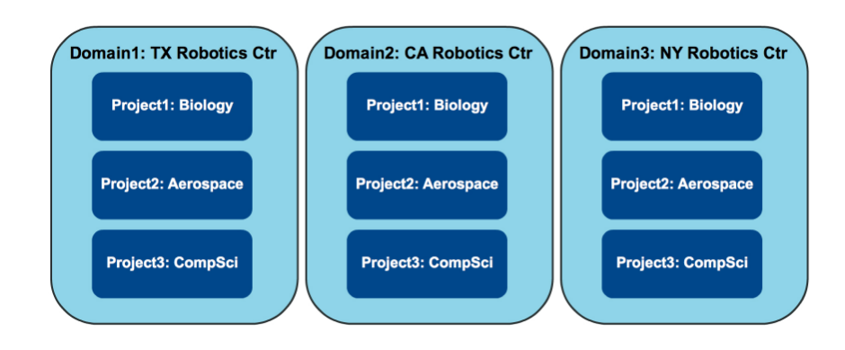
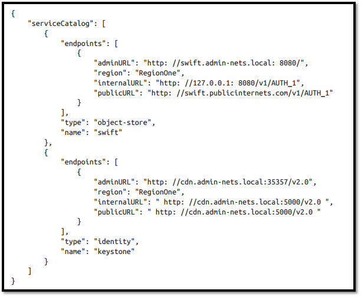

# Các thành phần và nhiệm vụ của Keystone

## 1. Các khái niệm của Keystone (Keystone concepts)
### 1.1. Projects
* Trong keystone, Project được dùng bởi các service của OPS để nhóm và cô lập các nguồn tài nguyên. Nó có thể hiểu là 1 nhóm các tài nguyên mà chỉ có một số các user mới có thể truy cập và hoàn toàn tách biệt với các nhóm khác.
* Ban đầu nó được gọi là tenants sau đó được đổi tên thành projects.
* Mục đích cơ bản nhất của Keystone chính là nơi để đăng ký cho các projects và xác định ai được phép truy cập project đó.
* Bản thân projects không sở hữu users hay groups mà users và groups được cấp quyền truy cập tới project sử dụng cơ chế gán role.
* Trong một vài tài liệu của OpenStack thì việc gán role cho user còn được gọi là "grant".

 

### 1.2. Domains
* Trong thời kì đầu, không có bất cứ cơ chế nào để hạn chế sự xuất hiện của các project tới những nhóm user khác nhau. Điều này có thể gây ra những sự nhầm lẫn hay xung đột không đáng có giữa các tên của project của các tổ chức khác nhau.
* Tên user cũng vậy và nó hoàn toàn cũng có thể dẫn tới sự nhầm lẫn nếu hai tổ chức có user có tên giống nhau.
* Vì vậy mà khái niệm Domain ra đời, nó được dùng để cô lập danh sách các Projects và Users.
* Domain được định nghĩa là một tập hợp các users, groups, và projects. Nó cho phép người dùng chia nguồn tài nguyên cho từng tổ chức sử dụng mà không phải lo xung đột hay nhầm lẫn.

 

### 1.3. Users và User Group (Actor)
* Trong keystone, Users và User Groups là những đối tượng được cấp phép truy cập tới các nguồn tài nguyên được cô lập trong domains và projects.
* Groups là một tập hợp các users. Users và User Groups gọi là actor
Mối quan hệt giữa domains, projects, users và groups:

 

### 1.4. Roles
* Roles được dùng để hiện thực hóa việc cấp phép trong keystone. Một actor có thể có nhiều roles đối với từng project khác nhau.
* Role được gán cho user và trên một project cụ thể ("assigned to" user, "assigned on" project)
### 1.5. Assignment
* Role assignment gồm một Role, một Resource và một Identity.
* Role assignment được cấp phát, thu hồi, và có thể được kế thừa giữa các users, groups, project và domains.
### 1.6. Targets
* Project và Domain đều có thể gán role. Từ đó sinh ra khái niệm target.
* Chính là project hoặc domain nào sẽ được gán Role cho user
### 1.7. Token
* Để user truy cập bất cứ OpenStack API nào thì user cần chúng minh họ là ai và họ được phép gọi tới API. Để làm được điều này, họ cần có token và "dán" chúng vào "API call". Keystone chính là service chịu trách nhiệm tạo ra tokens.
* Sau khi được xác thực thành công bởi keystone thì user sẽ nhận được token. Token cũng chứa các thông tin ủy quyền của user trên cloud.
* Token có cả phần ID và payload. ID được dùng để đảm bảo rằng nó là duy nhất trên mỗi cloud và payload chứa thông tin của user.

 

### 1.8. Catalog
* Chứa URLs và endpoints của các services khác nhau.
* Nếu không có Catalog, users và các ứng dụng sẽ không thể biết được nơi cần chuyển yêu cầu để tạo máy ảo hoặc lưu dữ liệu.
* Service này được chia nhỏ thành danh sách các endpoints và mỗi một endpoint sẽ chứa admin URL, internal URL, and public URL.

 

