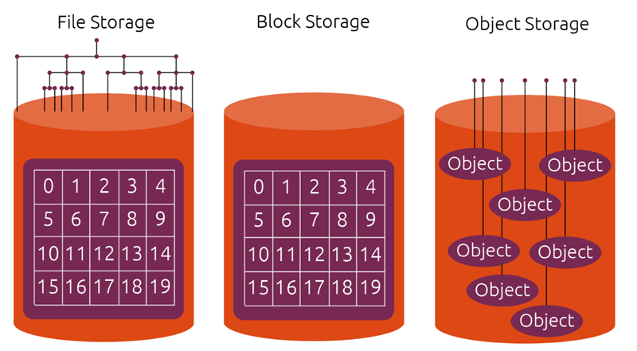

# Phân biệt và so sánh 3 loại lưu trữ Object Storage, Block Storage và File Storage

## Bảng so sánh tính năng của 3 loại lưu trữ

| Tính năng | Object Storage | File Storage | Block Storage |
|-----------|----------------|--------------|---------------|
| Cấu trúc dữ liệu | Phẳng, phi cấu trúc | Cây thư mục, cấu trúc | Khối, phi cấu trúc |
| Lưu trữ | Dữ liệu được chia thành các đối tượng (object) | Dữ liệu được lưu trữ trong các tệp và thư mục | Dữ liệu được lưu trữ trong các khối có kích thước cố định |
| Truy cập | Truy cập qua ID đối tượng (object ID) | Truy cập qua đường dẫn tệp | Truy cập qua địa chỉ khối |
| Khả năng mở rộng | Dễ dàng mở rộng theo nhu cầu | Khả năng mở rộng hạn chế | Dễ dàng mở rộng theo nhu cầu |
| Hiệu suất | Hiệu suất truy cập ngẫu nhiên thấp | Hiệu suất truy cập ngẫu nhiên cao | Hiệu suất truy cập tuần tự cao |
| Chi phí | Chi phí thấp cho dung lượng lớn | Chi phí cao hơn cho dung lượng lớn | Chi phí cao |
| Ứng dụng | Lưu trữ dữ liệu phi cấu trúc (hình ảnh, video, nhật ký), lưu trữ dự phòng | Chia sẻ tệp, lưu trữ ứng dụng | Hệ thống cơ sở dữ liệu, ảo hóa |

## Sự khác nhau giữa Object Storage, Block Storage và File Storage

* Object storage bao gồm nhiều object lưu trữ dữ liệu không cấu trúc như ảnh, file, video. Cách thức truy cập dựa trên giao thức HTTP và thông tin của object được lưu trữ và quản lý trong metadata. Nên lưu trữ đối tượng phù hợp để chia sẻ file ứng dụng cho các triển khai với khả năng mở rộng cao, multi-site.

* Còn dữ liệu trong Block storage được tổ chức trong block IDs. Và được tổ chức có cấu trúc hoặc các ứng dụng có cấu trúc. Client trong hệ điều hành kết nối với Block Storage thông qua Fibre Channel hoặc iSCSI hoặc sử dụng các thiết bị (DASD). Block Storage phù hợp cho các thông tin dưới dạng giao dịch hoặc có cấu trúc như file systems, databases, transactional logs, swap space, hoặc cho các VMs.

* Đối với File Storage, dữ liệu được lưu trữ dưới dạng file IDs qua mạng chia sẻ trên server. NFS và SMB là 2 giao thức phổ biến sử dụng để truy cập File Storage. Storage server hoặc cụm ổ đĩa sử dụng block storage với hệ thống file nội bộ để quản lý các file này. Và clients chỉ tương tác thông qua protocol và đường dẫn file. Các thuộc tính cố định như type, size, date created và date modified được lưu trữ trong hệ thống file.
