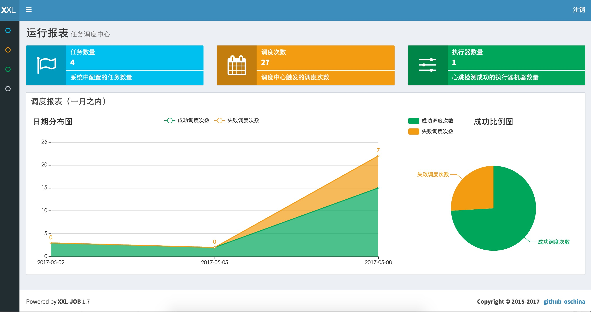

<h1>Cài đặt</h1>

## 1. Nguồn

 - **Địa chỉ tài liệu**
 
      <a href="https://www.xuxueli.com/xxl-job/">Tài liệu tiếng trung</a>
  
      <a href="https://www.xuxueli.com/xxl-job/en/">Tài liệu tiếng Anh</a>
  
 - **Địa chỉ kho mã nguồn** 

      <table>
                            <thead>
                            <tr>
                                <th rowspan="2">Địa chỉ kho mã nguồn</th>
                                <th rowspan="2">Tải xuống bản phát hành</th>
                            </tr>
                            </thead>
                            <tbody>
                            <tr>
                                <td><a href="https://github.com/xuxueli/xxl-job">https://github.com/xuxueli/xxl-job</a></td>
                                <td><a href="https://github.com/xuxueli/xxl-job/releases">Tải xuống</a></td>
                            </tr>
                            <tr>
                                <td><a href="http://gitee.com/xuxueli0323/xxl-job">http://gitee.com/xuxueli0323/xxl-job</a></td>
                                <td><a href="https://gitee.com/xuxueli0323/xxl-job/releases">Tải xuống</a></td>
                            </tr>
                            <tr>
                                <td><a href="https://gitcode.com/xuxueli0323/xxl-job">https://gitcode.com/xuxueli0323/xxl-job</a></td>
                                <td><a href="https://gitcode.com/xuxueli0323/xxl-job/tags">Tải xuống</a></td>
                            </tr>
                            </tbody>
                        </table>
                    
  - **Địa chỉ kho trung tâm**

      ```xml
        <!-- http://repo1.maven.org/maven2/com/xuxueli/xxl-job-core/ -->
    <dependency>
        <groupId>com.xuxueli</groupId>
        <artifactId>xxl-job-core</artifactId>
        <version>${最新稳定版本}</version>
    </dependency>
    ```

## 2. Môi trường

  - Maven3+
  - Jdk1.8+
  - Mysql8.0+

## 3. Cài đặt

### 3.1. Khởi tạo "Cơ sở dữ liệu lập lịch"

  - Tải xuống mã nguồn dự án và giải nén nó, lấy "Tập lệnh SQL khởi tạo cơ sở dữ liệu lập lịch" và thực thi nó.

  - Vị trí của "Tập lệnh SQL khởi tạo cơ sở dữ liệu" là:

    ```sql
      /xxl-job/doc/db/tables_xxl_job.sql
    ```
    
  - Trung tâm điều phối hỗ trợ triển khai cụm Trong một cụm, mỗi nút phải được kết nối với cùng một phiên bản mysql;

  - Nếu mysql hoạt động như master-slave, nút cụm trong trung tâm điều phối phải buộc phải sử dụng cơ sở dữ liệu chính;

### 3.2 Biên dịch mã nguồn

  - Giải nén mã nguồn, nhập mã nguồn vào IDE theo định dạng maven và sử dụng maven để biên dịch. Cấu trúc mã nguồn như sau:

    ```yml
    xxl-job-admin: trung tâm điều phối
    xxl-job-core: phụ thuộc công khai
    xxl-job-executor-samples: Mẫu người thực thi (chọn phiên bản phù hợp của người thực thi để sử dụng trực tiếp hoặc bạn có thể tham khảo và chuyển đổi dự án hiện có thành người thực thi)
        ：xxl-job-executor-sample-springboot: Phiên bản Springboot, quản lý bộ thực thi thông qua Springboot, phương pháp này được khuyên dùng;
        : xxl-job-executor-sample-frameless: phiên bản không khung;
    ```

### 3.3 Cấu hình và triển khai "Trung tâm lập kế hoạch"

    ```yml
    Dự án trung tâm điều phối: xxl-job-admin
    Chức năng: Quản lý thống nhất các tác vụ lập lịch trên nền tảng lập lịch tác vụ, chịu trách nhiệm kích hoạt thực thi lập lịch và cung cấp nền tảng quản lý tác vụ.
    ```

  - **Bước 1**: Cấu hình trung tâm điều phối:
    
  Địa chỉ file cấu hình trung tâm điều phối:

  ```sql
    /xxl-job/xxl-job-admin/src/main/resources/application.properties
  ```

  Mô tả nội dung cấu hình trung tâm điều phối:

  ```sql
     ### Liên kết JDBC của trung tâm điều phối: Vui lòng giữ địa chỉ liên kết phù hợp với địa chỉ của cơ sở dữ liệu công văn được tạo trong Chương 2.1
      spring.datasource.url=jdbc:mysql://127.0.0.1:3306/xxl_job?useUnicode=true&characterEncoding=UTF-8&autoReconnect=true&serverTimezone=Asia/Shanghai
      spring.datasource.username=root
      spring.datasource.password=root_pwd
      spring.datasource.driver-class-name=com.mysql.jdbc.Driver
     ### Email cảnh báo
      spring.mail.host=smtp.qq.com
      spring.mail.port=25
      spring.mail.username=xxx@qq.com
      spring.mail.password=xxx
      spring.mail.properties.mail.smtp.auth=true
      spring.mail.properties.mail.smtp.starttls.enable=true
      spring.mail.properties.mail.smtp.starttls.required=true
      spring.mail.properties.mail.smtp.socketFactory.class=javax.net.ssl.SSLSocketFactory
      ### TOKEN giao tiếp của trung tâm điều phối [tùy chọn]: được bật khi không trống;
      xxl.job.accessToken=
      ### Cấu hình trung tâm điều độ quốc tế [bắt buộc]: Mặc định là "zh_CN"/Tiếng Trung giản thể, phạm vi tùy chọn là "zh_CN"/Tiếng Trung giản thể, "zh_TC"/Tiếng Trung phồn thể và "en"/Tiếng Anh;
      xxl.job.i18n=zh_CN
      ### Lập lịch cấu hình luồng tối đa của nhóm luồng [bắt buộc]
      xxl.job.triggerpool.fast.max=200
      xxl.job.triggerpool.slow.max=100
      ### Số ngày lưu dữ liệu bảng nhật ký của trung tâm điều phối [bắt buộc]: nhật ký hết hạn sẽ tự động được xóa; nó có hiệu lực khi giới hạn lớn hơn hoặc bằng 7, nếu không, chẳng hạn như -1, chức năng làm sạch tự động bị tắt;
      xxl.job.logretentiondays=30 
  ```

  - **Bước 2**: Triển khai dự án:

  Nếu cấu hình trên được thực hiện chính xác, dự án có thể được biên dịch, đóng gói và triển khai.

  Địa chỉ truy cập trung tâm điều phối: http://localhost:8080/xxl-job-admin (địa chỉ này sẽ được người thi hành sử dụng làm địa chỉ gọi lại)

  Tài khoản đăng nhập mặc định là "admin/123456". Sau khi đăng nhập, giao diện chạy như hình bên dưới: 

  <p align="center">
     
  </p>

  - **Bước 3**: Cụm trung tâm điều độ (tùy chọn):
  Trung tâm điều phối hỗ trợ triển khai cụm để cải thiện khả năng khắc phục thảm họa và tính khả dụng của hệ thống điều phối.

    - Khi triển khai cụm trung tâm điều phối có một số yêu cầu và đề xuất:

       - Cấu hình DB vẫn nhất quán;
       - Đồng hồ của cụm máy vẫn nhất quán (cụm máy đơn bỏ qua chúng);
       - Khuyến nghị: Nên sử dụng nginx để cân bằng tải cụm trung tâm điều phối và phân bổ tên miền. Các hoạt động như truy cập trung tâm điều phối, cấu hình lệnh gọi lại của người thực thi và các dịch vụ API gọi điện đều được thực hiện thông qua tên miền này.


  
  

  
